# 【学术图例】党建引领研究—20个机制与分析框架

> 来源：微信公众号「赫尔墨斯的公共管理百宝袋」（2024-11-05）
> 原文：http://mp.weixin.qq.com/s?__biz=MzkxMzQ1MjM5OQ==&mid=2247489608&idx=1&sn=212512b422b5b64e29e8c7abf764cae5
> ⚠️ 图片版权归原作者与期刊所有，仅作学术索引；引用请引原始论文。

> 注：完整收录：20 组 24 张（经浏览器全文提取）。

## 🌰1.许宝君.社区社会组织从“娱乐化”向“治理型”转变的党建引领机制研究[J].江汉论坛,2024,(08):137-144.

| 图1 |
|---|
| 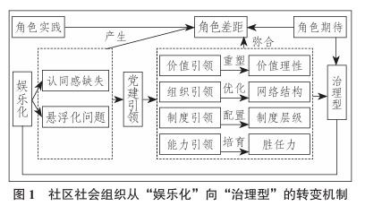 |

## 🌰2.谢小芹.党建引领城市社区治理的运行机制——基于H社区的扩展个案研究[J].求索,2024,(04):161-170.

| 图1 |
|---|
| 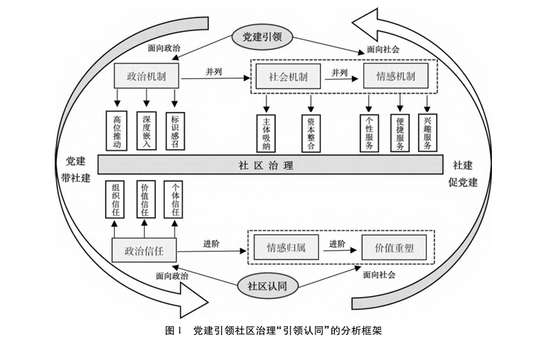 |

## 🌰3.唐皇凤,徐植.新时代党建引领城市精细化治理的机制建构与优化路径[J].内蒙古社会科学,2024,45(04):2+62-71.

| 图1 |
|---|
| 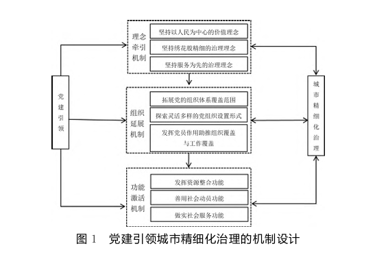 |

## 🌰4.向玉琼,李天聪. 场域重塑与跨域交互：党建引领社区治理共同体构建的内生逻辑——基于X市H社区“红色四邻工作法”的案例研究 [J]. 中共天津市委党校学报, 2024, 26 (04): 57-66.

| 图1 | 图2 |
|---|---|
| 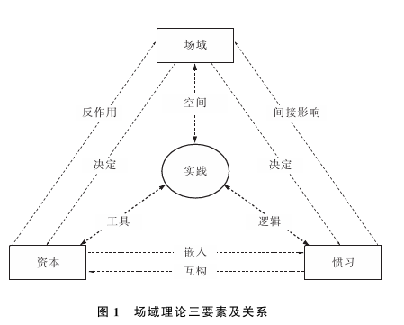 | 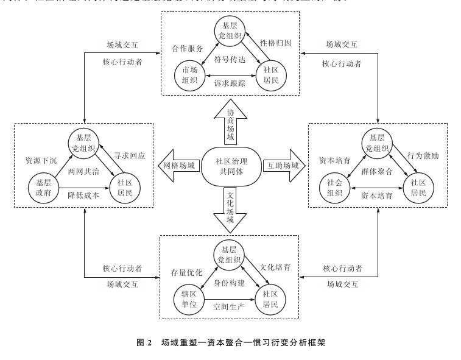 |

## 🌰5.阚道远,杨宁.区域党建一体化驱动跨域协同治理：作用机制与实践框架——基于长三角一体化实践的研究[J].治理研究,2024,40(03):127-141+160.

| 图1 |
|---|
| 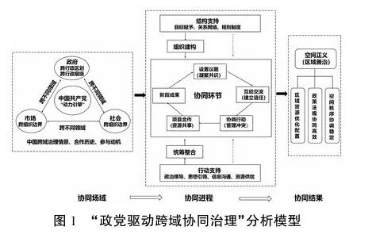 |

## 🌰6.刘丽莉,温碧霞. 党建引领下的乡村情感治理实现机制 [J]. 经济社会体制比较, 2023, (05): 120-129+140.

| 图1 | 图2 |
|---|---|
| 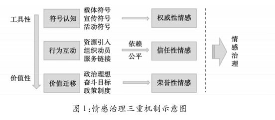 | 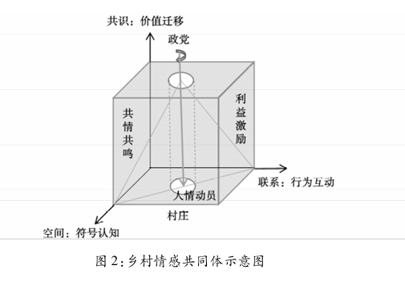 |

## 🌰7.王杰,黄忠春,任劭喆.治理生态视角下党建引领社区治理的实现机制——以福州XG社区为例[J].岭南学刊,2023,(04):60-67.

| 图1 |
|---|
| 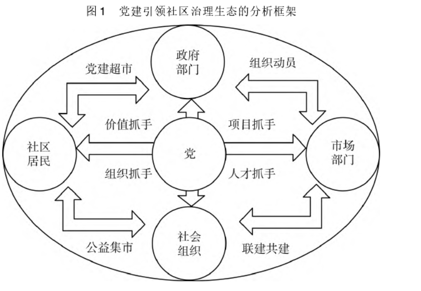 |

## 🌰8.罗敏.从“自治”到“共治”:党建引领社区治理的运行机制与创新模式[J].中共天津市委党校学报,2023,25(03):35-45.

| 图1 |
|---|
| 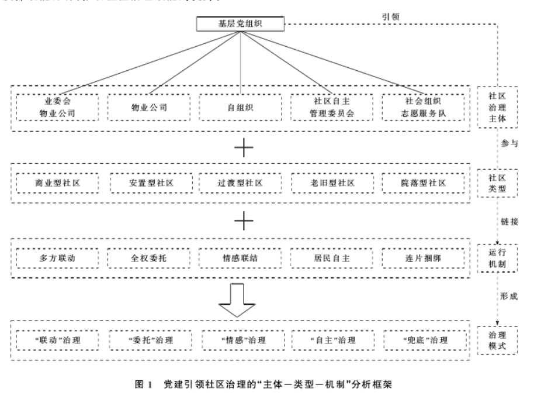 |

## 🌰9.魏来,徐锦杰,涂一荣.党建引领基层治理：实践机制与组织逻辑[J].社会主义研究,2023,(01):105-115.

| 图1 |
|---|
| 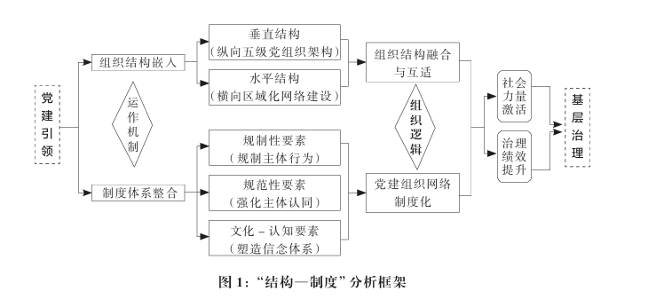 |

## 🌰10.陈柏峰,石建.党建引领嵌入社区治理的机制研究——以豫东B街道“红色物业”为例[J].江苏大学学报(社会科学版),2022,24(05):45-61.

| 图1 |
|---|
| 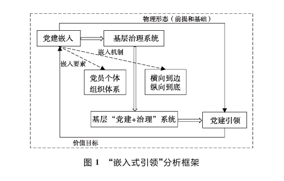 |

## 🌰11.吴高辉,郭小聪.党建何以引领脱贫目标的实现?——政党引领与国家基础权力比较视角下的多案例研究[J].公共管理与政策评论,2022,11(04):137-150.

| 图1 |
|---|
| 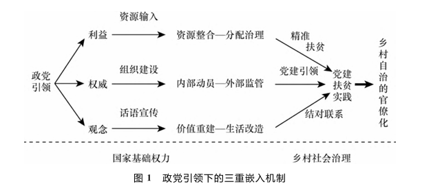 |

## 🌰12.李倩.中国情境下党建引领如何推动基层有效治理：关键行动者与多重因素驱动[J].信息技术与管理应用,2024,3(01):46-58.

| 图1 |
|---|
| 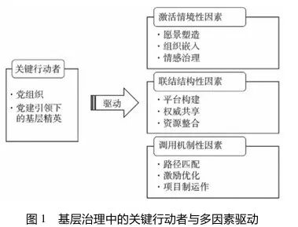 |

## 🌰13.詹国辉.嵌入、吸纳与协商：党建引领乡村振兴的理论框架与实践逻辑——基于苏A县案例的考察[J].湖南农业大学学报(社会科学版),2024,25(04):69-76.

| 图1 | 图2 |
|---|---|
| 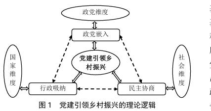 | 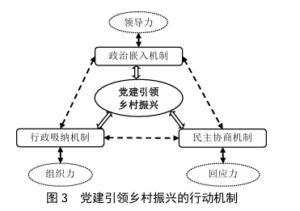 |

## 🌰14.聂平平,黄文敏.势能下沉与动能转化：党建引领乡村治理的实践图景——一项质性元分析[J].上海行政学院学报,2024,25(02):4-16.

| 图1 | 图2 |
|---|---|
| 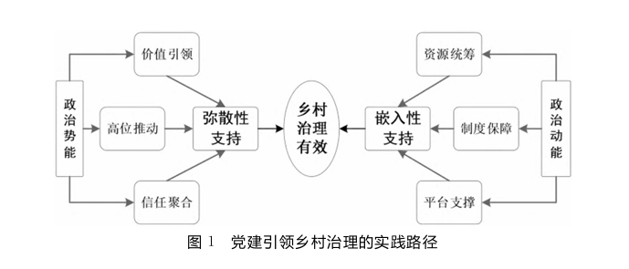 | 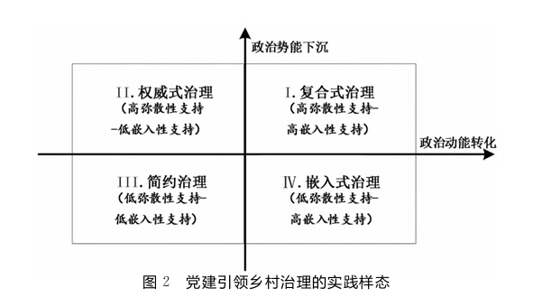 |

## 🌰15.吕越颖,李威利.基于精英的“双向赋能”:党建引领乡村治理的重要路径[J].中国农村研究,2023,(01):123-138.

| 图1 |
|---|
| 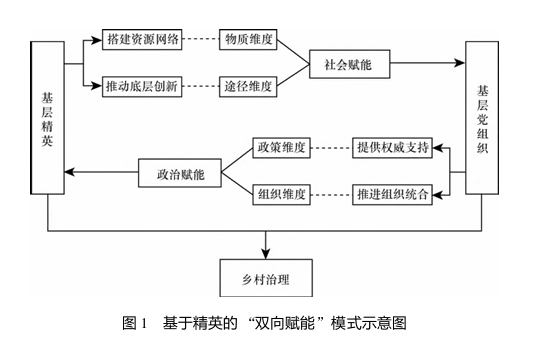 |

## 🌰16.朱亚鹏,易敏,崔雨鑫. 党建引领如何破解中国基层治理的三重困境？——基于广州市南沙区的实践 [J]. 治理研究, 2024, 40 (03): 61-78+158+2.

| 图1 | 图2 |
|---|---|
| 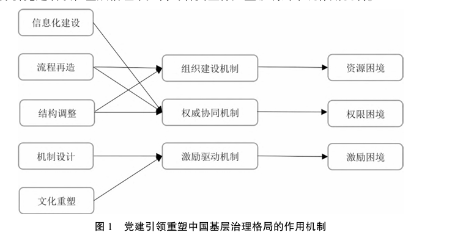 | 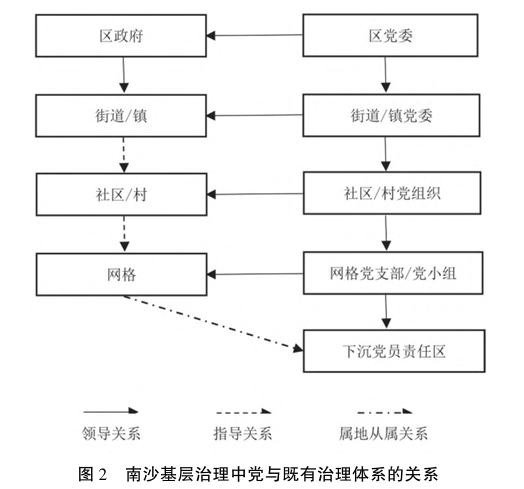 |

## 🌰17.温雪梅,吴炫菲. 党建引领下的社区自治何以可能？——一个多重逻辑的分析框架 [J]. 长白学刊, 2024, (02): 14-28.

| 图1 | 图2 |
|---|---|
| 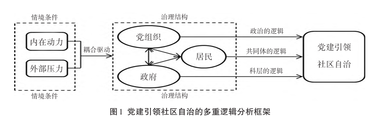 | 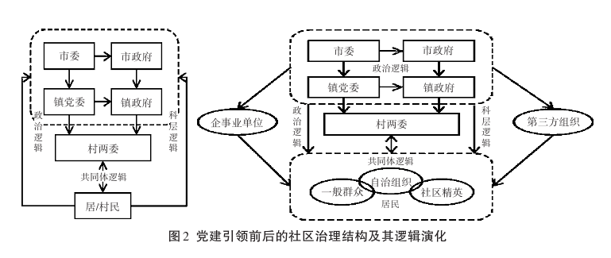 |

## 🌰18.岳经纶,刘洋. 党建引领社区善治的逻辑——基于浙江省N街道的研究 [J]. 治理研究, 2021, 37 (05): 59-69.

| 图1 |
|---|
| 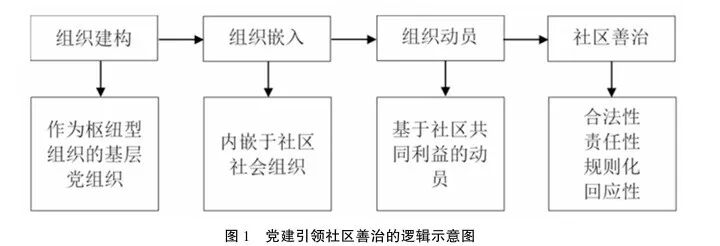 |

## 🌰19.彭勃,杜力. “超行政治理”:党建引领的基层治理逻辑与工作路径 [J]. 理论与改革, 2022, (01): 59-75+156-157.

（原文此处未附图）

## 🌰20.唐兴军. 耦合与超越：党建引领基层治理的机制创新与效能提升 [J]. 南京社会科学, 2024, (07): 27-37.

（原文此处未附图）
