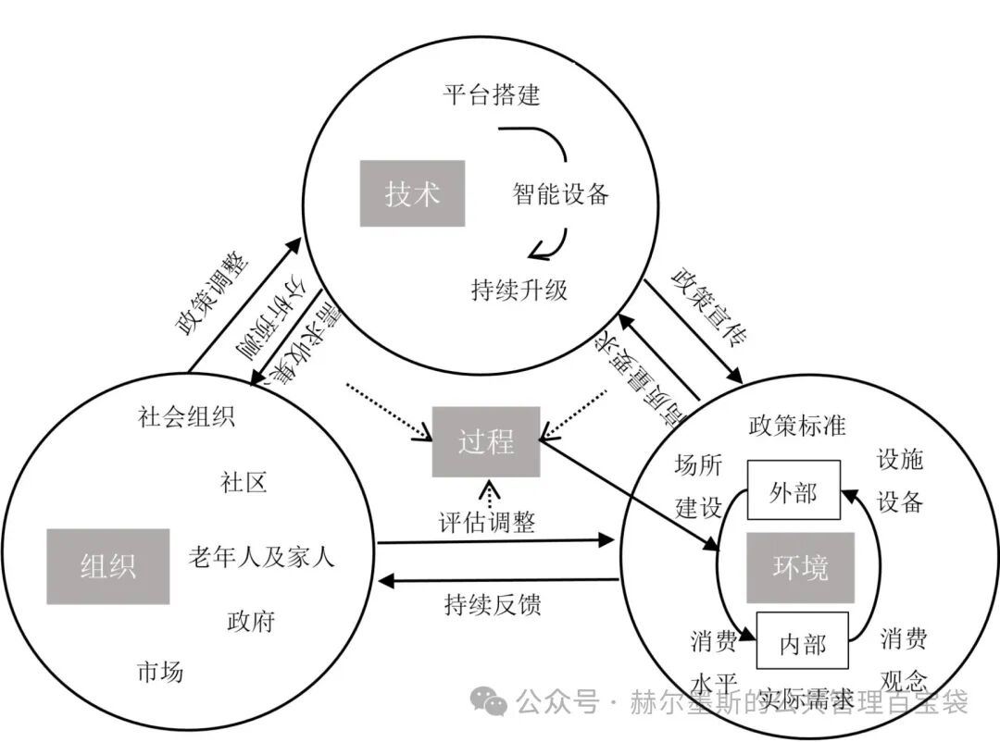
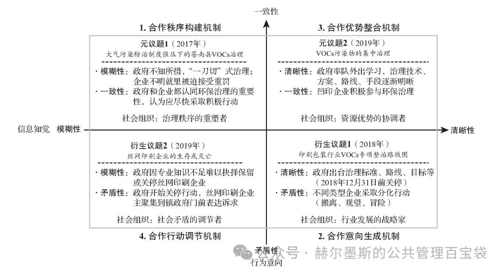
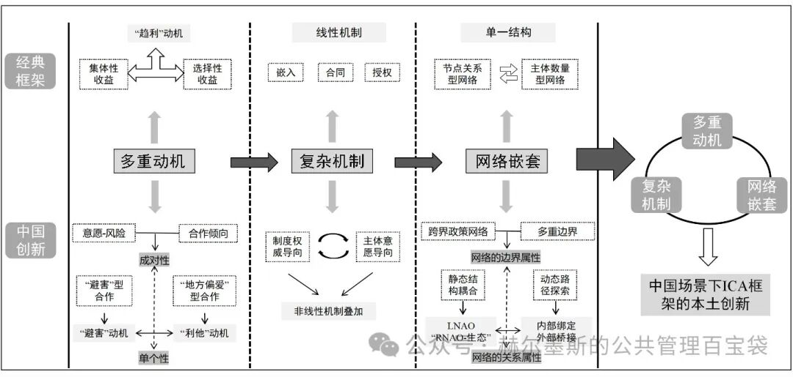
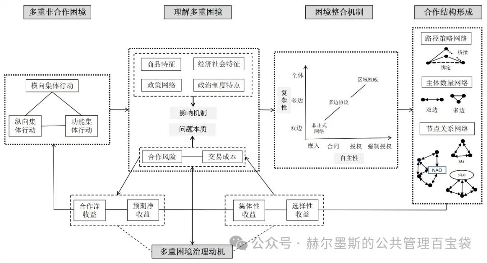
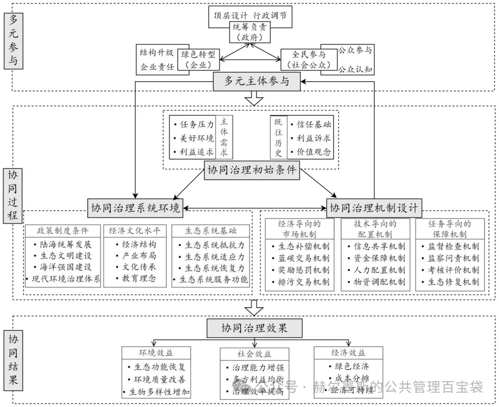

# 【学术图例】公共治理研究——16 个机制与分析框架

> 来源：微信公众号「赫尔墨斯的公共管理百宝袋」（制 2025-04-19）
> 原文：http://mp.weixin.qq.com/s?__biz=MzkxMzQ1MjM5OQ==&mid=2247495118&idx=2&sn=2aebae250748294ad4fbb33402f7ba14
> ⚠️ 图片版权归原作者与期刊所有，仅作学术索引。

## 🌰1. 张成岗, 宁学斯. 基层社区智慧养老的生成逻辑及实践路径——基于TOE框架的案例探索 [J/OL]. 公共管理学报, 1-15.

| 图1 智慧养老建设在TOE框架中的因果关系图 | 图2 TOE框架下的智慧养老运行机制 |
| --- | --- |
|  |  |

## 🌰2. 张舜禹, 郁建兴, 朱心怡. 政府与社会组织合作治理的形成机制——一个组织间构建共识性认知的分析框架 [J]. 浙江大学学报(人文社会科学版), 2022, 52(01): 67-81.

| 图1 基于共识性认知的合作治理形成机制 | 图2 社会组织角色演变推进合作治理 |
| --- | --- |
|  |  |

## 🌰3. 锁利铭, 贾小岗. 制度性集体行动框架下的中国协作治理：本土化应用与一般性拓展 [J]. 理论探讨, 2025, (02): 97-111.

| 图1 制度性集体行动框架的基本逻辑 | 图2 从政策到治理的演化 | 图3 中国ICA框架研究的创新拓展 |
| --- | --- | --- |
|  |  |  |

## 🌰4. 余静, 徐玥, 张坤珵. 钩织合力：海岸带生态环境协同治理何以可能？——基于长岛海洋生态文明综合试验区的扎根理论研究 [J/OL]. 公共管理学报, 1-20.

| 图1 海岸带生态环境协同治理逻辑的解释框架 | 图2 多元主体协作关系 |
| --- | --- |
|  |  |

## 🌰5. 郑莹, 于君博, 胡沛验. 权威的建构：数据管理机构推进数字化跨部门综合监管的机制研究 [J/OL]. 公共管理学报, 1-25.

| 图1 | 图2 |
| --- | --- |
|  |  |

> 注：原文标注 16 个图例，抓取时返回前 5 个示例，其余请至原文查看。
