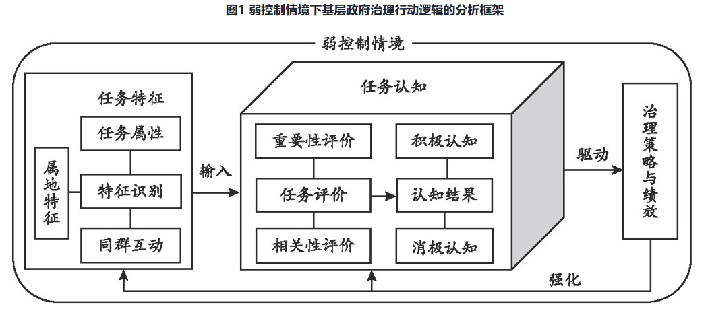
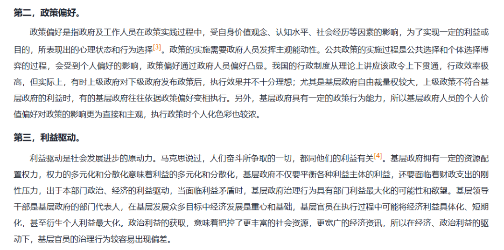

# 【学术图例】基层政府治理策略的三种视角：结构-任务-行动

> 来源：微信公众号「赫尔墨斯的公共管理百宝袋」（制 2025-08-26）
> 原文：http://mp.weixin.qq.com/s?__biz=MzkxMzQ1MjM5OQ==&mid=2247497918&idx=1&sn=ab22af2b500919615ffea1877071cf35
> 参考来源：向良云. 弱控制情境下基层政府治理的行动逻辑 [J]. 中国行政管理, 2025, 41(06): 80-90.
> ⚠️ 图片版权归原作者与期刊所有，仅作学术索引。

## 三种视角总览图

## 视角一：结构视角（结构性因素）

自上而下路径，关注层级节制、任务下派与实施分离：

1. 激励强弱与任务可考核性的组合 —— 贺雪峰, 桂华. 行政激励与乡村治理的逻辑 [J]. 学术月刊, 2022, 54(07).
2. 多重压力源间的关联性互动 —— 付奇, 王庭辉. 压力机制与组织调适 [J]. 行政论坛, 2025, 32(02).
3. "激励—问责"的组合差异 —— 吴克昌, 唐煜金. 权衡于奖惩之间 [J]. 公共行政评论, 2022, 15(06).
4. 权力与责任的失衡 —— 陈水生. 从压力型体制到督办责任体制 [J]. 行政论坛, 2017, 24(05).

## 视角二：任务视角（任务特征）

1. 任务信息模糊性与行政目标确定性的矛盾 —— 张峰. 模糊性与确定性：政府治理中"层层加码"现象的再阐释 [J]. 华东理工大学学报（社科版）, 2024(6).
2. 任务适用性与执行压力的张力 —— 陈家建, 张琼文. 政策执行波动与基层治理问题 [J]. 社会学研究, 2015, 30(03).
3. 目标定位与基层环境的匹配度 —— 李迎生, 等. 福利治理、政策执行与社会政策目标定位 [J]. 社会学研究, 2017, 32(06).
4. 政策空间与组织资源的组合 —— 支广东, 李强彬. 政策空间、组织资源与基层政府政策执行的差异化策略 [J]. 中国行政管理, 2024, 40(03).
5. 风险约束与治理资源的分配 —— 吕方. 治理情境分析：风险约束下的地方政府行为 [J]. 社会学研究, 2013, 28(02).
6. 任务设计与组织目标和环境的兼容程度 —— 艾云. 上下级政府间"考核检查"与"应对"过程的组织学分析 [J]. 社会, 2011, 31(03).
7. 多重任务目标叠加的不确定性 —— 崔晶. 中国情境下政策执行中的"松散关联式"协作 [J]. 管理世界, 2022, 38(06).

## 视角三：行动视角（主体性因素）

1. 任务对象群体的刻板印象 —— 李伟权, 黄扬. 政策执行中的刻板印象：一个"激活-应用"的分析框架 [J]. 公共管理学报, 2019, 16(03).
2. 任务选择的自由裁量权 —— 赵继娣, 等. 街头官僚优先处置何种任务？ [J]. 公共管理与政策评论, 2022, 11(04).
3. 政策偏好与利益驱动 —— 卢江阳, 吴湘玲. 基层政府治理行为偏差的生成逻辑与矫正维度探析 [J]. 中州学刊, 2023(02).
4. 领导注意力的分配 —— 庞明礼. 领导高度重视：一种科层运作的注意力分配方式 [J]. 中国行政管理, 2019(04).
5. 避责或邀功的行为取向 —— 倪星, 王锐. 从邀功到避责：基层政府官员行为变化研究 [J]. 政治学研究, 2017(02).

> 完整文献综述文字见 digest/学术图例-基层政府治理三种视角-2025-08-26.md
