# 【学术图例】11个研究技术路线框架

> 来源：微信公众号「赫尔墨斯的公共管理百宝袋」（2025-04-14）
> 原文：http://mp.weixin.qq.com/s?__biz=MzkxMzQ1MjM5OQ==&mid=2247494889&idx=1&sn=6ca4394682a16b4904fef9e7b91fcaf8
> ⚠️ 图片版权归原作者与期刊所有，仅作学术索引；引用请引原始论文。

> 注：完整收录：11 组 11 张（经浏览器全文提取）。

## 🌰1.侯光辉.邻避-地方性危机[D].天津大学,2019.

| 图1 |
|---|
| 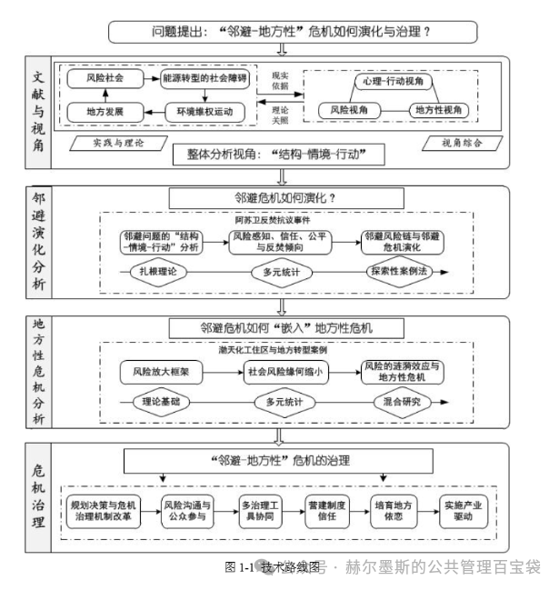 |

## 🌰2.武慧.基于“气候变化—生态价值—人类扰动”制图的自然保护地管护成效评价及空间格局构建[D].中国地质大学,2023.

| 图1 |
|---|
| 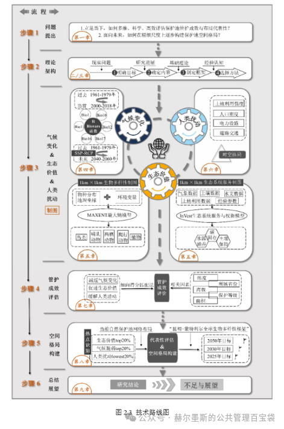 |

## 🌰3.谢玉洁.黄河流域生态环境脆弱性治理的跨行政区域协调机制研究[D].山东工商学院,2023.

| 图1 |
|---|
| 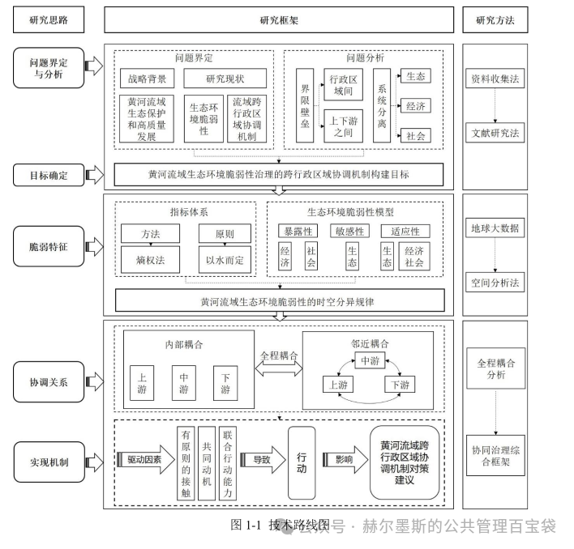 |

## 🌰4.程哲.中国城市老旧小区改造的政策执行研究[D].中共中央党校(国家行政学院),2023.

| 图1 |
|---|
| 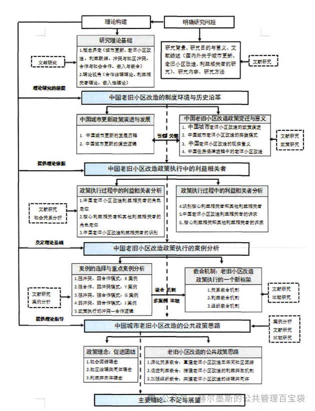 |

## 🌰5.谢垚.政府奖惩下闭环供应链快递纸箱回收策略研究[D].天津理工大学,2019.

| 图1 |
|---|
| 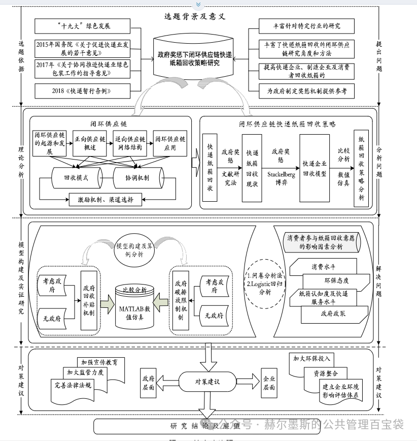 |

## 🌰6.王巧.中国低碳城市试点政策“嵌套执行”及其效果研究[D].华中科技大学,2021.

| 图1 |
|---|
| 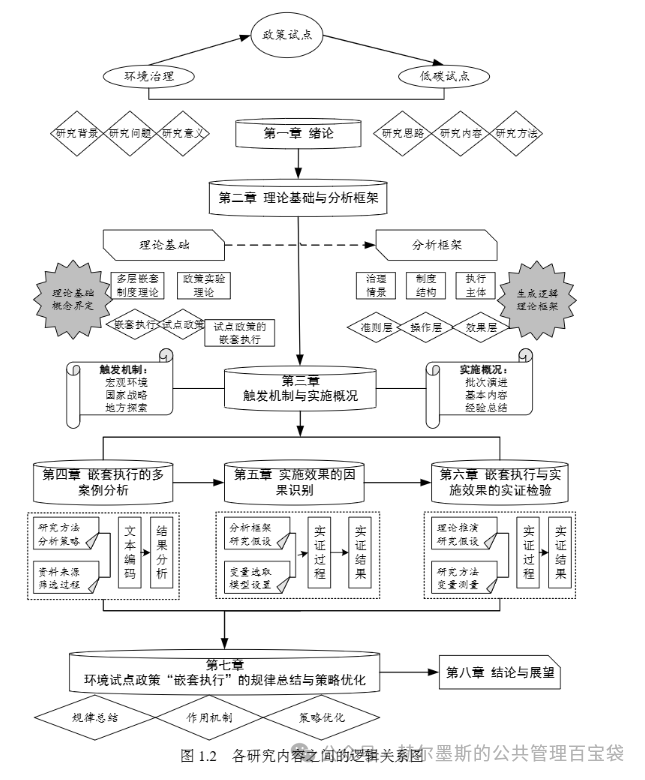 |

## 🌰7.张志英.政府研发资助、研发模式与纺织业创新绩效关系研究[D].浙江理工大学,2021.

| 图1 |
|---|
| 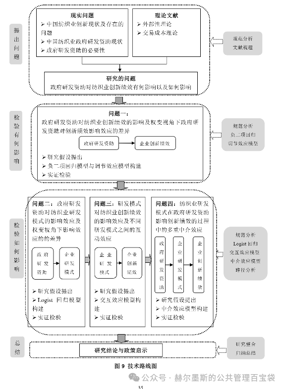 |

## 🌰8.李兆洋.政策过程视角下的清单治理：一个“动议-共识-绩效”的分析框架[D].重庆大学,2021.

| 图1 |
|---|
| 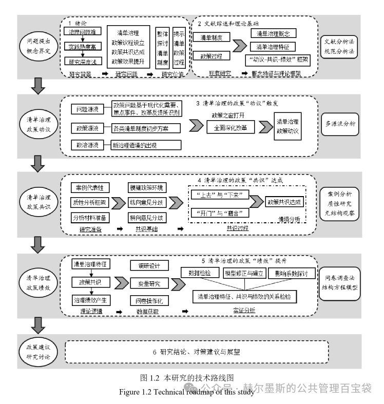 |

## 🌰9.王飞龙.水库移民家庭收入非农化研究[D].华北电力大学(北京),2024.

| 图1 |
|---|
| 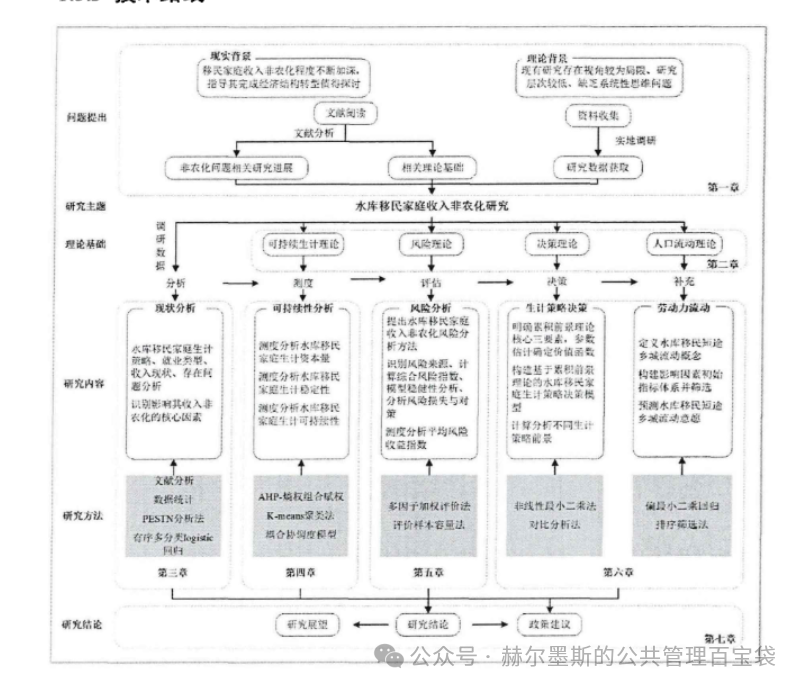 |

## 🌰10.夏霆.企业科技创新对国家安全内容的影响及政府规制研究[D].中共中央党校（国家行政学院）,2024.

| 图1 |
|---|
| 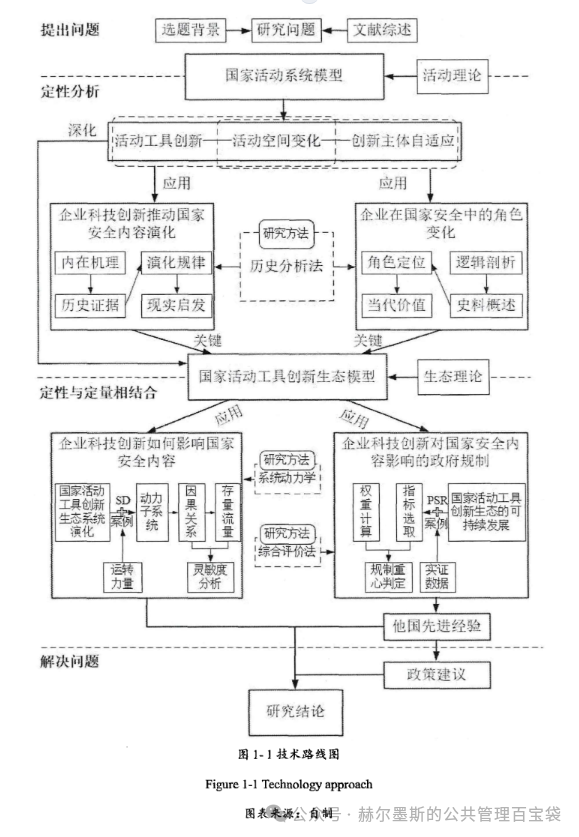 |

## 🌰11.石峰.中美政府数据开放政策比较研究[D].云南财经大学,2023.

| 图1 |
|---|
| 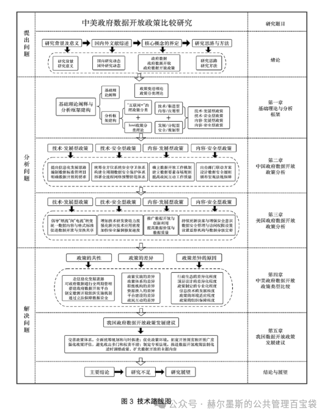 |
