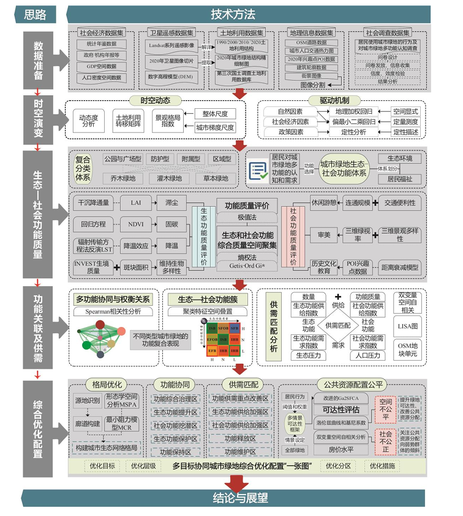
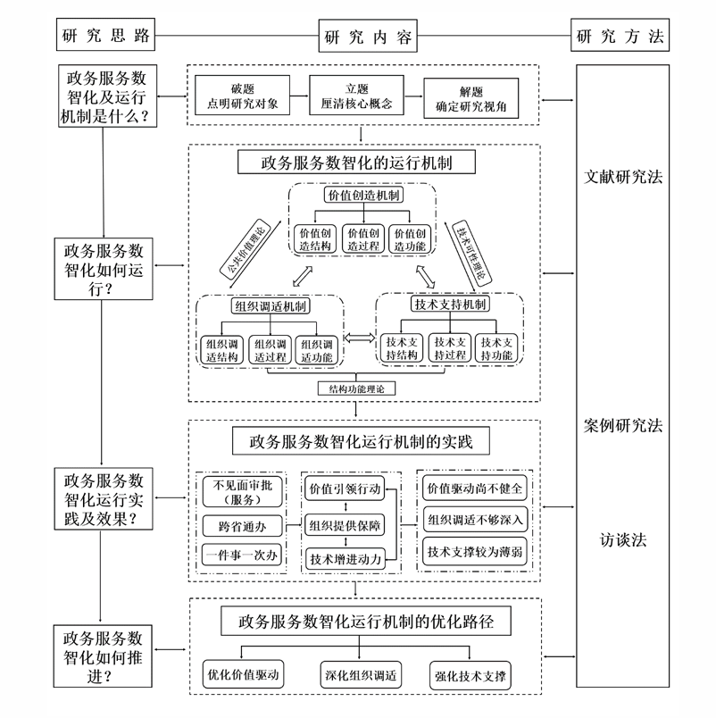
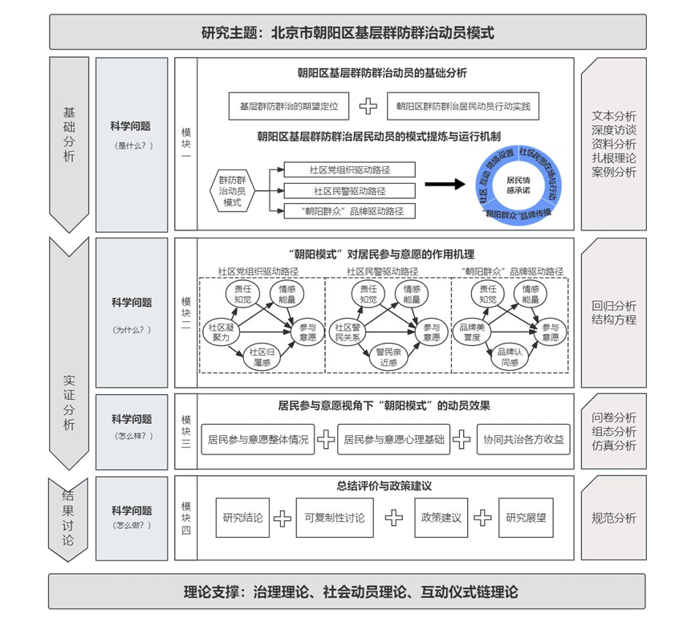
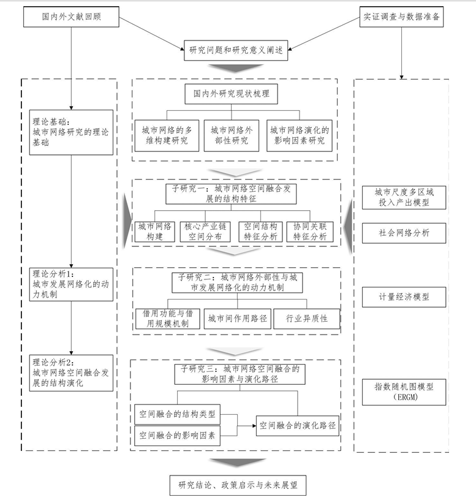
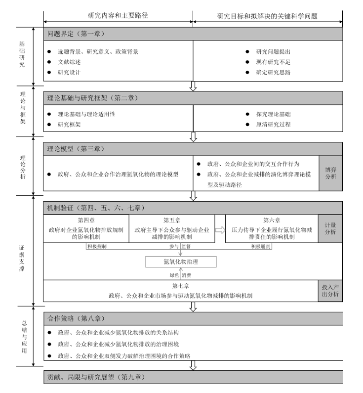
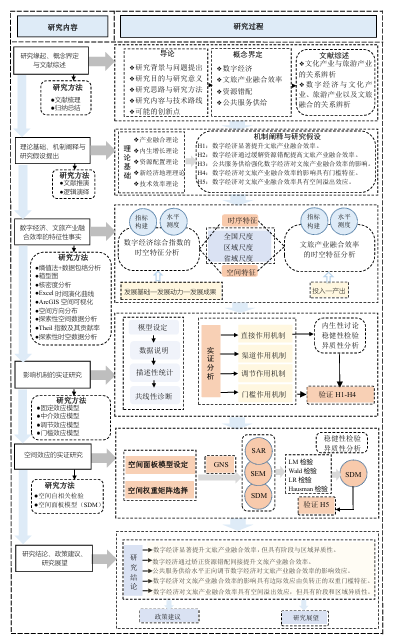
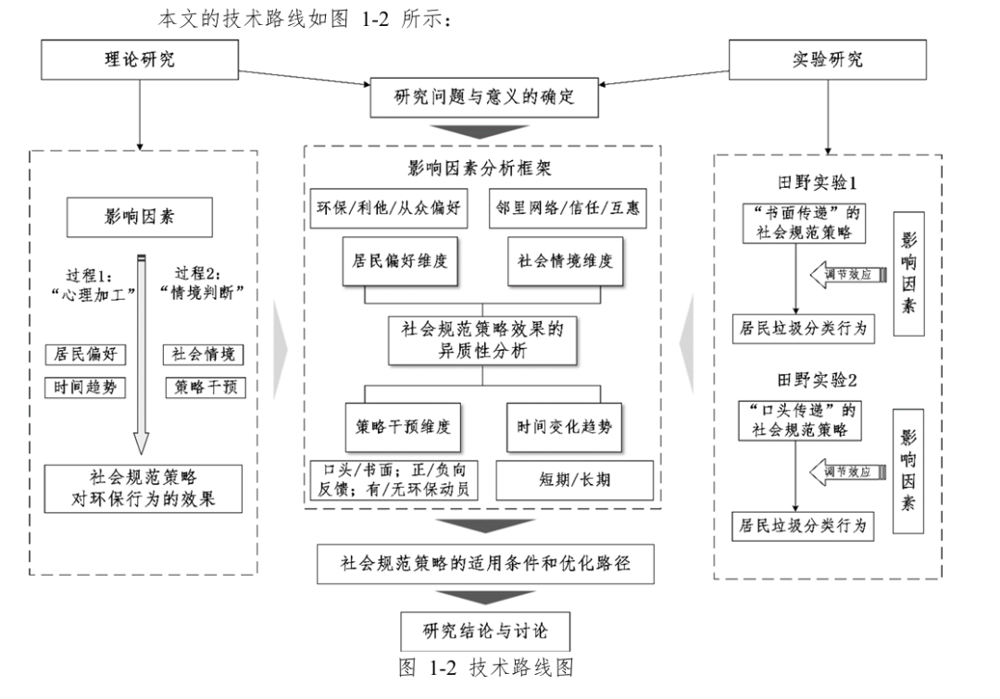
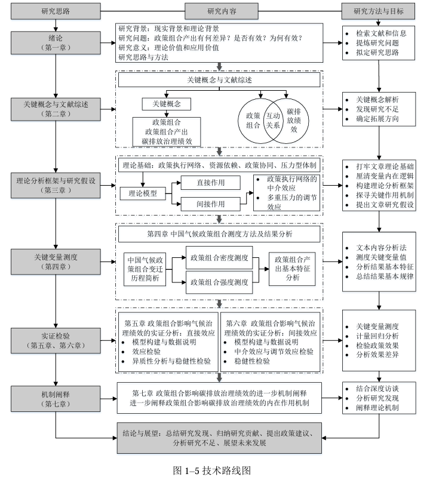
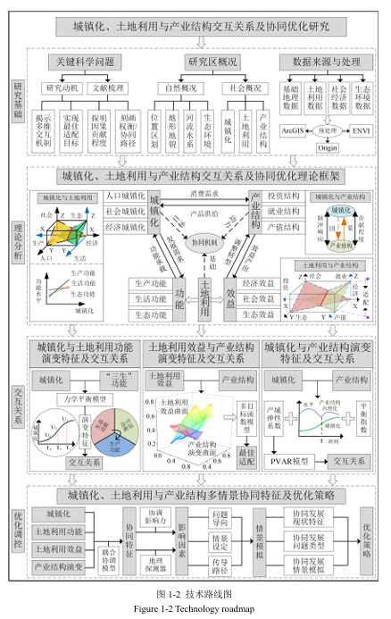

# 【学术图例】研究技术路线框架（part5，含 part1–4 往期索引）

> 来源：微信公众号「赫尔墨斯的公共管理百宝袋」（制 2025-06-25）
> 原文：http://mp.weixin.qq.com/s?__biz=MzkxMzQ1MjM5OQ==&mid=2247496685&idx=1&sn=55bc1689e68894965696f76689870bc8
> 往期：常见的技术路线图 / 精选—技术路线图 / 11个研究技术路线框架 / 10个研究技术路线框架（见公众号历史消息）
> ⚠️ 图片版权归原作者与学位论文作者所有，仅作学术索引。

## 🌰1. 吴松泽. 基于生态-社会功能的城市绿地质量及优化配置研究 [D]. 吉林大学, 2024.

## 🌰2. 刘玮. 基于"价值-技术-组织"框架的政务服务数智化运行机制研究 [D]. 中国矿业大学, 2024.

## 🌰3. 田一笑. 社会安全治理视域下城市基层群防群治动员模式研究 [D]. 中国人民公安大学, 2024.

## 🌰4. 孙艺文. 城市网络的空间融合发展：结构特征、动力机制与演化路径 [D]. 浙江大学, 2024.

## 🌰5. 韩继磊. 政府、公众和企业合作治理大气污染物及策略研究 [D]. 兰州大学, 2024.

## 🌰6. 郭炎冰. 数字经济对文旅产业融合效率的影响机制及空间效应研究 [D]. 山西财经大学, 2024.

## 🌰7. 褚晓菁. 基于社会规范的助推策略对居民环保行为的影响及其异质性研究 [D]. 浙江大学, 2024.

## 🌰8. 要蓉蓉. 政策组合何以影响碳排放治理绩效：机制阐释与实证检验 [D]. 华南理工大学, 2024.

## 🌰9. 和伟康. 城镇化、土地利用与产业结构交互关系及协同优化研究 [D]. 中国矿业大学, 2023.

