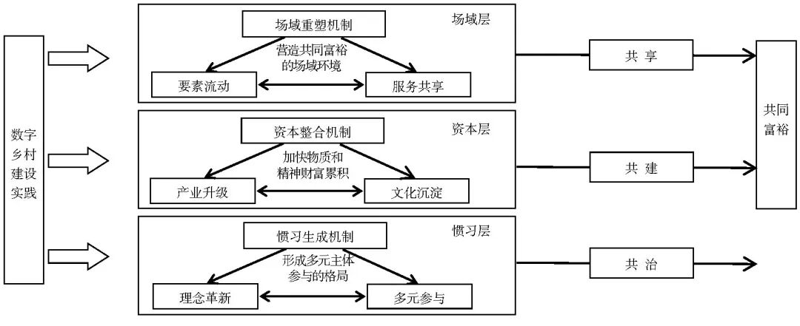
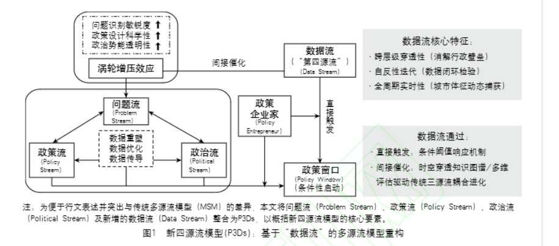
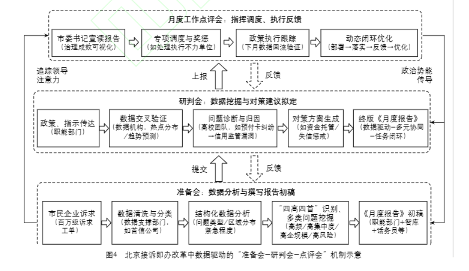
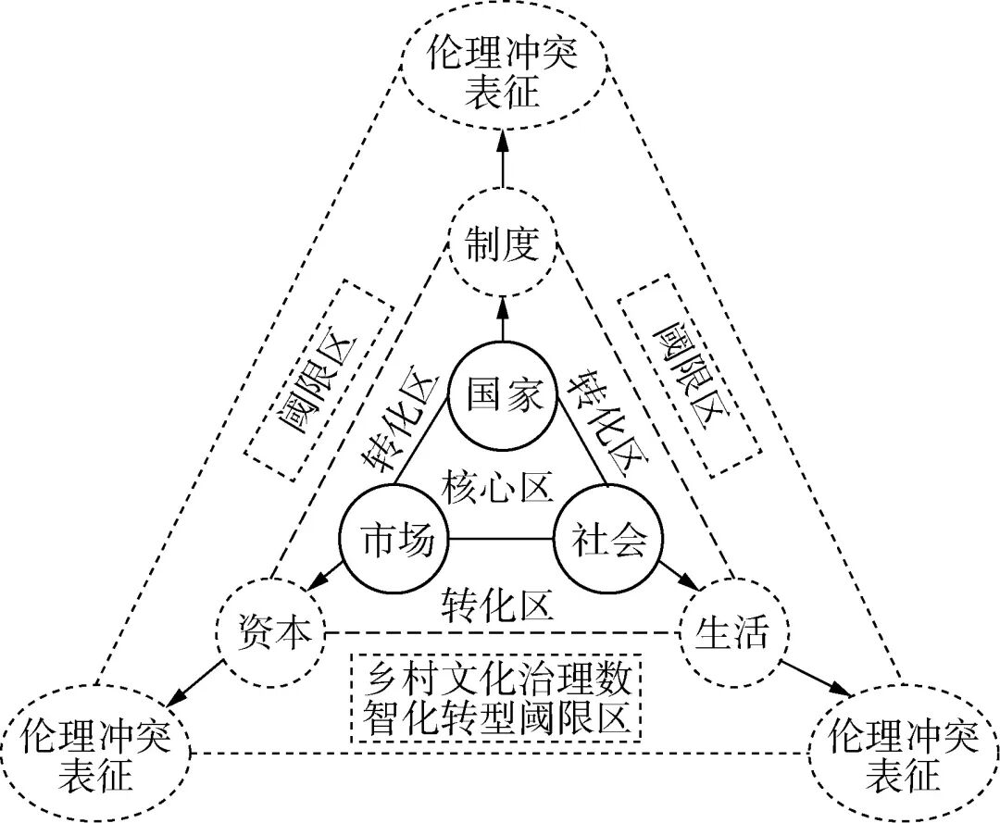
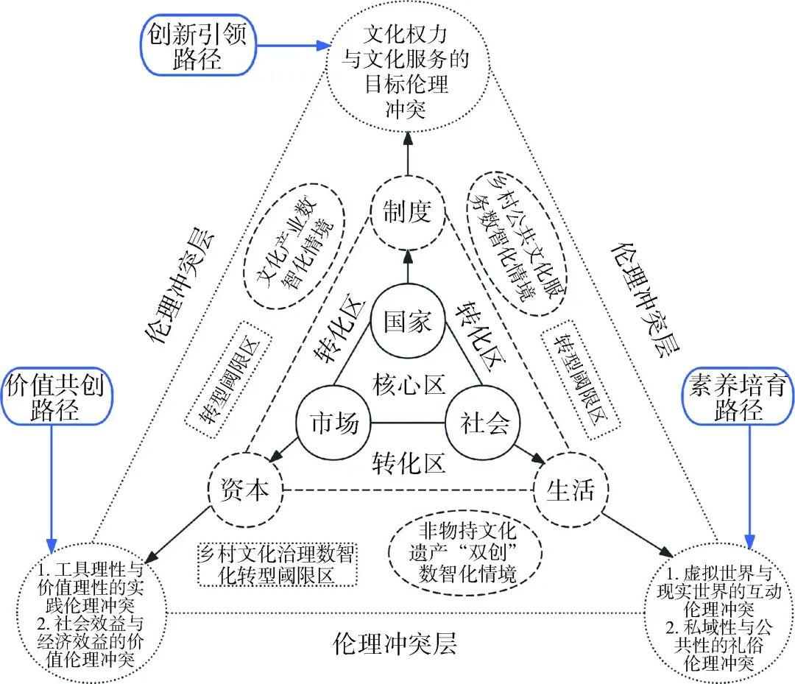

# 【学术图例】数字治理与数字（智）化转型研究——12 个机制与分析框架

> 来源：微信公众号「赫尔墨斯的公共管理百宝袋」（制 2025-06-23）
> 原文：http://mp.weixin.qq.com/s?__biz=MzkxMzQ1MjM5OQ==&mid=2247496643&idx=1&sn=77561887582ae5f53e1390a366b60394
> ⚠️ 图片版权归原作者与期刊所有，仅作学术索引。

## 🌰1. 吕守军, 贺一舟. 数据要素协同治理何以化解公共数据开发利用的"反公地悲剧"？ [J/OL]. 电子政务, 1-15.

| 图1 | 图2 |
| --- | --- |
|  |  |

## 🌰2. 郝文强, 唐亚林. 平台赋能与网络协同：城市治理数字化场景价值共创的过程与机制——基于S市A区的案例研究 [J/OL]. 电子政务, 1-14.

| 图1 | 图2 | 图3 |
| --- | --- | --- |
|  |  |  |

## 🌰3. 文宏, 王晟. 制度嵌入与组织调适：数字治理视角下"高效办成一件事"的实现机制——基于佛山"秒报秒批秒付"改革的案例分析 [J/OL]. 电子政务, 1-13.

| 图1 | 图2 |
| --- | --- |
|  |  |

## 🌰4. 康传彬. 注意力偏移与主体性消解：数字化转型中的老年群体政务服务可及性障碍及其破解 [J/OL]. 电子政务, 1-13.

## 🌰5. 李博, 贺子娟. 数字乡村建设促进共同富裕的机制探析——基于场域-资本-惯习的分析框架 [J]. 湖南农业大学学报(社会科学版), 2025, 26(03): 84-92.

## 🌰8. 杜玉春, 黄一然, 张小劲. 数据流：数智化转型中公共政策议程设置的"第四源流"——基于北京接诉即办改革的多源流模型重构 [J/OL]. 电子政务, 1-15.

| 图1 | 图2 |
| --- | --- |
|  |  |

## 🌰9. 李少惠, 何志强. 乡村文化治理数智化转型：伦理冲突与纾解之道 [J]. 河海大学学报(哲学社会科学版), 2024, 26(06): 58-68.

| 图1 | 图2 |
| --- | --- |
|  |  |

> 注：原文标注 12 个图例，抓取时返回其中 7 个示例，其余请至原文查看。
