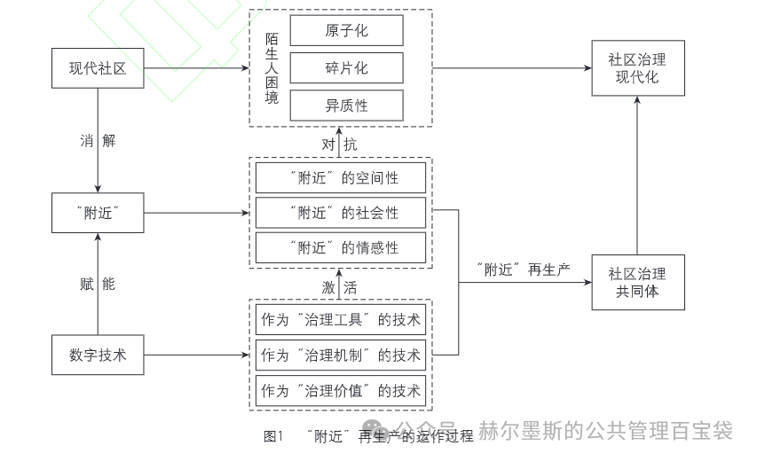
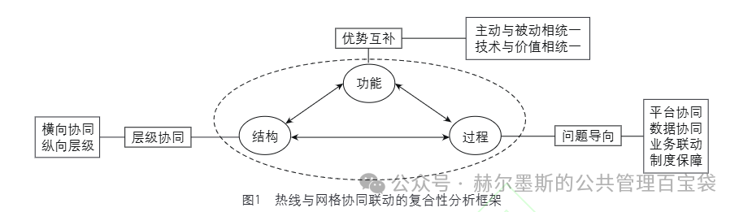
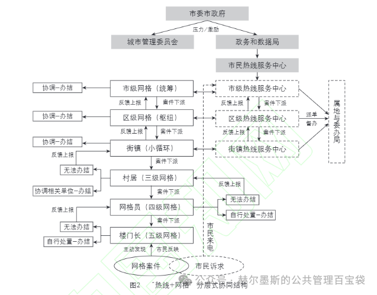
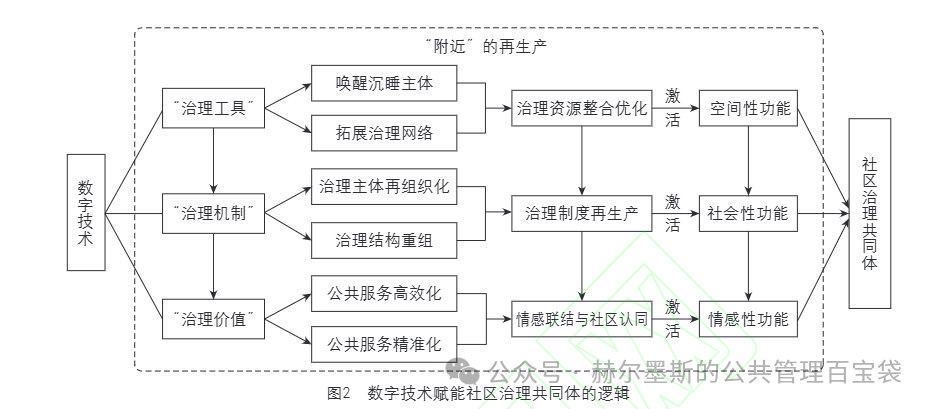
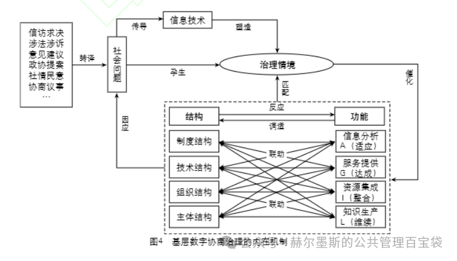
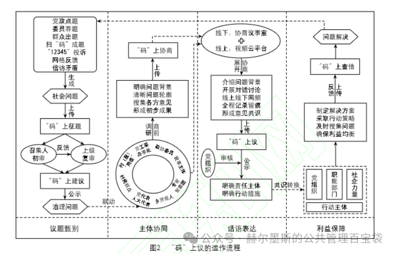
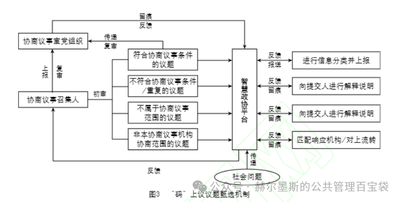
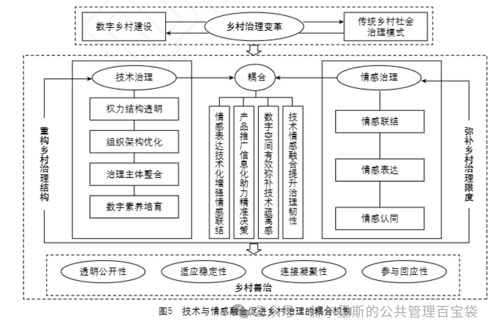
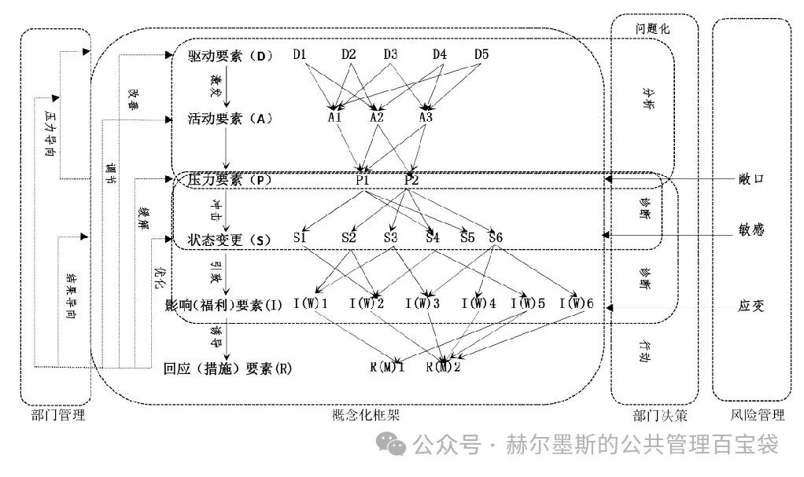
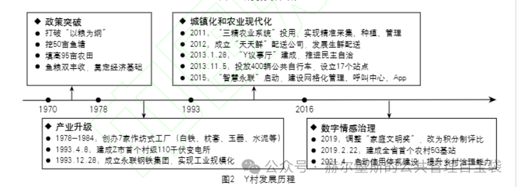

# 【学术图例】数字治理研究（二）——15 个机制与分析框架

> 来源：微信公众号「赫尔墨斯的公共管理百宝袋」（制 2025-05-16）
> 原文：http://mp.weixin.qq.com/s?__biz=MzkxMzQ1MjM5OQ==&mid=2247495510&idx=1&sn=6d0e90dc885c5e566a8b97ed4938562d
> ⚠️ 图片版权归原作者与期刊所有，仅作学术索引。

## 🌰2. 张京唐, 邓明磊, 殷旺来. "附近"的再生产：技术赋能与社区治理共同体建构——以杭州市L社区为例 [J/OL]. 电子政务, 1-11.

| 图1 | 图2 |
| --- | --- |
|  |  |

## 🌰3. 吴金鹏, 孟庆国, 张楠. 政务热线与网格化管理协同联动何以实现？——基于北京市"热线+网格"案例分析 [J/OL]. 电子政务, 1-11.

| 图1 | 图2 |
| --- | --- |
|  |  |

## 🌰6. 徐明强, 许汉泽. 乡村数字治理中的技术悬浮及其生态化应对——基于H县"321"基层社会治理大数据平台的案例研究 [J/OL]. 电子政务, 1-12.

| 图1 | 图2 |
| --- | --- |
|  |  |

## 🌰9. 王俐, 袁鑫. 江苏县域数字乡村建设的有效路径及对策研究——基于LDA模型与fsQCA方法的实证探索 [J]. 中国矿业大学学报(社会科学版), 2024, 26(06): 173-188.

## 🌰10. 唐方成, 裴利娟, 董彩婷, 等. 数字平台的二元治理模式——价值共创视角下的探索性案例研究 [J]. 管理评论, 2024, 36(05): 276-288.

| 图1 | 图2 |
| --- | --- |
|  |  |

## 🌰11. 沈费伟, 叶温馨. 基层政府数字治理的运作逻辑、现实困境与优化策略 [J]. 管理学刊, 2020, 33(06): 26-35.

## 🌰14. 潘琳, 李兴腾, 李珮. 政务大模型赋能数字政府治理：驱动逻辑与优化路径——基于"结构-过程-功能"的分析框架 [J]. 重庆工商大学学报(社会科学版), 2025, 42(02): 68-80.

## 🌰15. 杨雅南. 数字化转型中的地方政府整体治理：一个问题结构化网络模型的构建 [J]. 行政科学论坛, 2022, 9(01): 20-25.

| 图1 | 图2 |
| --- | --- |
|  |  |

> 注：原文标注 15 个图例，抓取时返回其中 8 个示例，其余请至原文查看。
