# 【学术图例】新质生产力研究——25 个机制与分析框架、指标设计、时序

> 来源：微信公众号「赫尔墨斯的公共管理百宝袋」（制 2024-11-19）；经商业新知镜像页抓取
> 镜像：https://www.shangyexinzhi.com/article/23342691.html
> ⚠️ 图片版权归原作者与期刊所有，仅作学术索引。

## 🌰1. 王珏. 新质生产力：一个理论框架与指标体系 [J]. 西北大学学报(哲学社会科学版), 2024, 54(1): 35-44.

| 图1 | 图2 |
| --- | --- |
|  |  |

## 🌰2. 郭晗, 侯雪花. 新质生产力推动现代化产业体系构建的理论逻辑与路径选择 [J]. 西安财经大学学报, 2024, 37(1): 21-30.

## 🌰3. 李阳, 陈海龙, 田茂再. 新质生产力水平的统计测度与时空演变特征研究 [J]. 统计与决策, 2024, 40(09): 11-17.

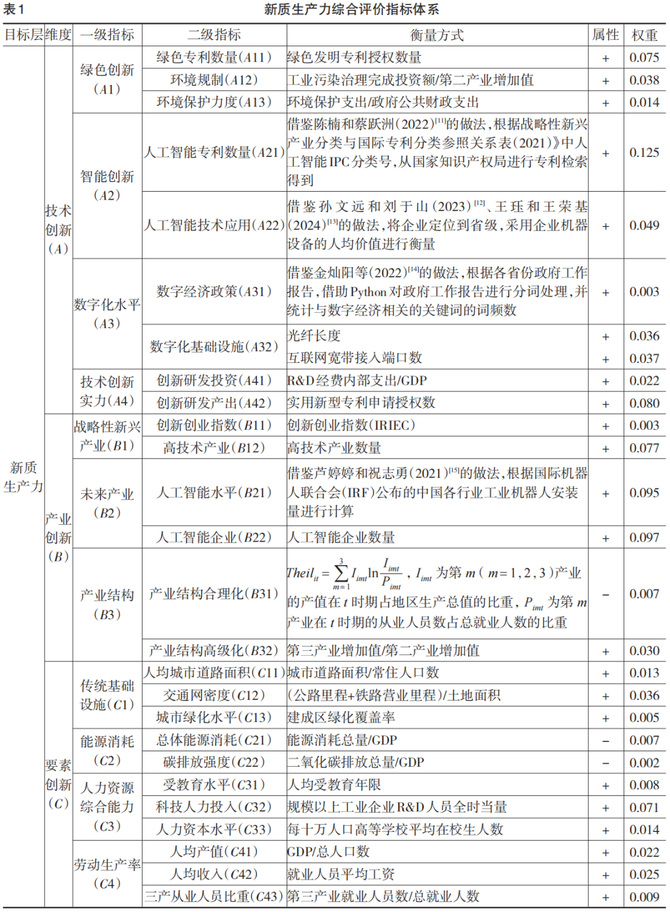

## 🌰4. 王珏, 王荣基. 新质生产力：指标构建与时空演进 [J]. 西安财经大学学报, 2024, 37(1): 31-47.

## 🌰5. 石玉堂, 王晓丹, 陈凯旋. 新质生产力与城市经济韧性：理论逻辑与经验证据 [J]. 重庆大学学报(社会科学版), 2024.

| 图1 | 图2 |
| --- | --- |
| 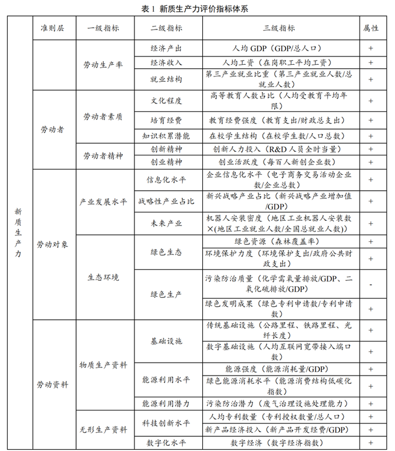 |  |

## 🌰6. 蒋永穆, 薛蔚然. 新质生产力理论推动高质量发展的体系框架与路径设计 [J]. 商业经济与管理, 2024(5): 81-92.

| 图1 | 图2 |
| --- | --- |
|  | 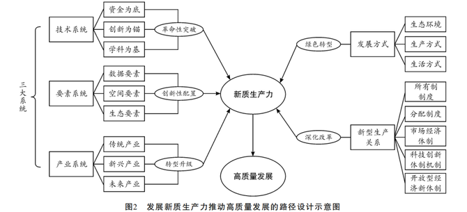 |

## 🌰7. 翟云, 潘云龙. 数字化转型视角下的新质生产力发展——基于"动力-要素-结构"框架的理论阐释 [J]. 电子政务, 2024(3).

| 图1 | 图2 |
| --- | --- |
| 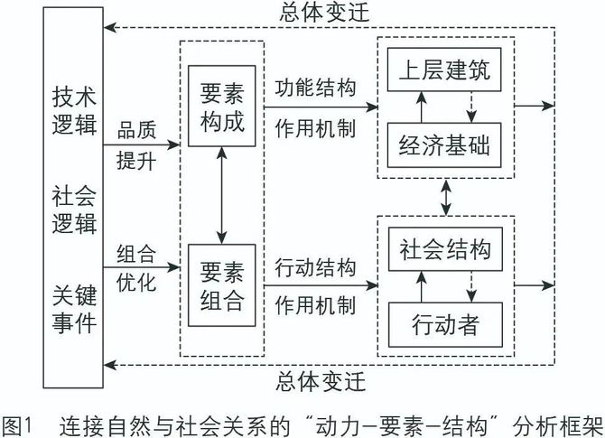 | 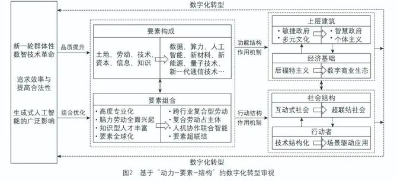 |

## 🌰8. 米加宁, 吴佳正, 李大宇, 等. 数字政府与新质生产力耦合协同发展的理论构建 [J]. 电子政务, 2024(09): 2-14.

| 图1 | 图2 | 图3 |
| --- | --- | --- |
| 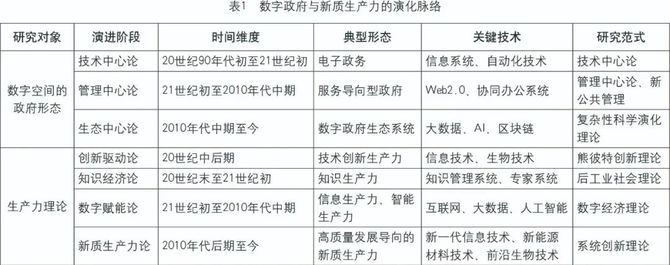 | 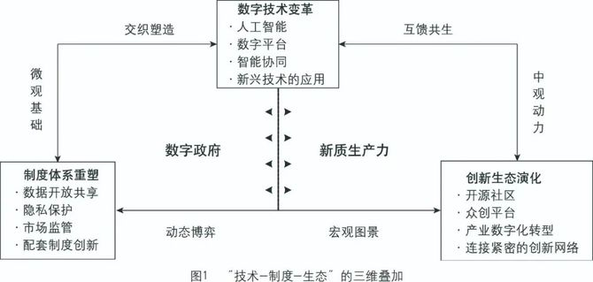 | 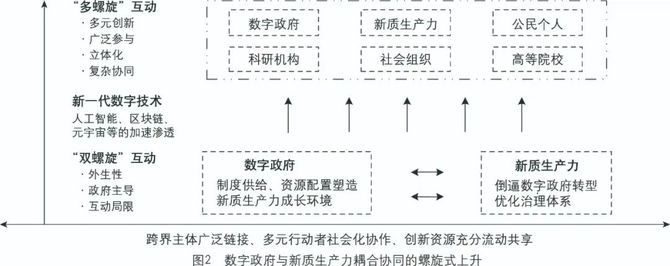 |

## 🌰9. 卢鹏. 数实融合驱动新质生产力涌现的逻辑与实践进路 [J]. 电子政务, 2024(09): 27-37.

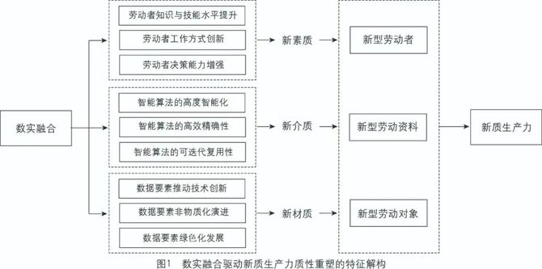

## 🌰10. 王小芳, 王磊. 数字政府如何促进新质生产力发展：作用模式及其实现路径 [J]. 电子政务, 2024(09): 15-26.

| 图1 | 图2 |
| --- | --- |
| 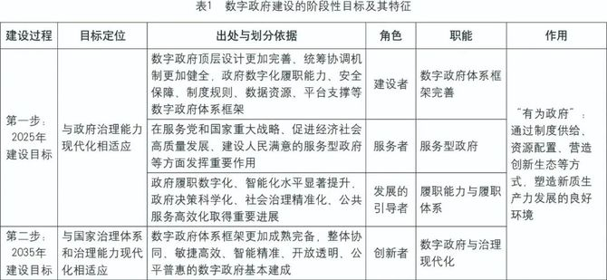 | 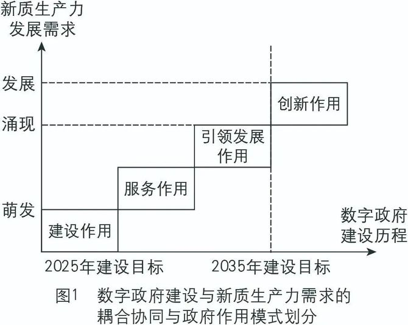 |

## 🌰11. 王洛忠, 徐成铭, 赵阳光. 公共服务精准管理助推新质生产力：作用机理与实践路径 [J]. 郑州大学学报(哲学社会科学版), 2024(4).

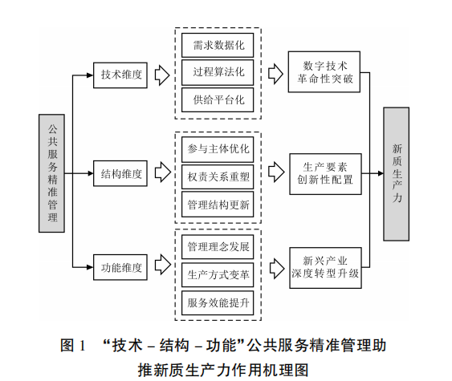

## 🌰12. 王学军. 发展新质生产力的政府作用：内在逻辑与实践进路 [J]. 行政论坛, 2024, 31(3): 76-83.

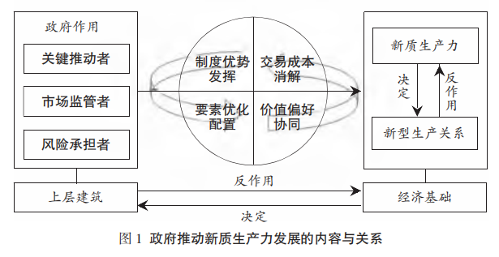

## 🌰13. 米加宁, 李大宇, 董昌其. 算力驱动的新质生产力：本质特征、基础逻辑与国家治理现代化 [J]. 公共管理学报, 2024, 21(2): 1-14.

| 图1 | 图2 | 图3 |
| --- | --- | --- |
| 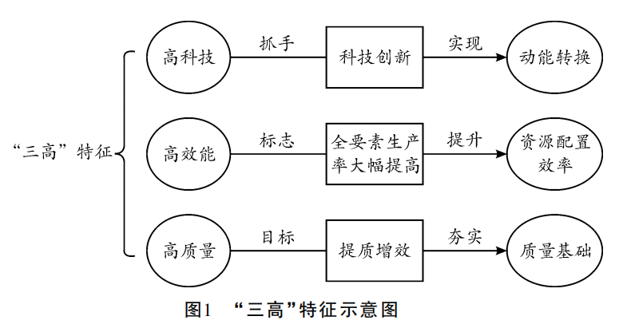 |  | 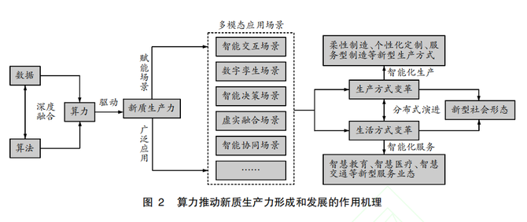 |

| 图4 | 图5 |
| --- | --- |
| 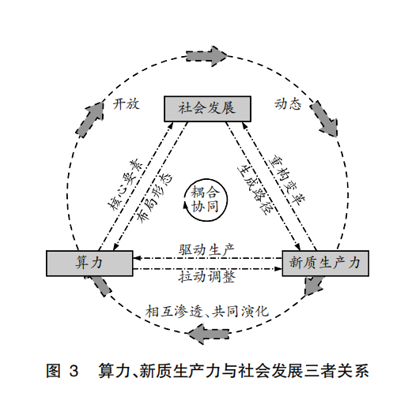 | 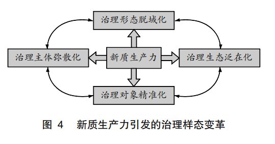 |

## 🌰14. 郭栋, 尤帅, 刘云. 数字化改革赋能新质生产力：理论内涵、动力机制、关键主体及提升路径 [J]. 社会科学家, 2024(2): 45-51.

## 🌰15. 刘海军, 翟云. 数字时代的新质生产力：现实挑战、变革逻辑与实践方略 [J]. 党政研究, 2024(3).

| 图1 | 图2 |
| --- | --- |
| 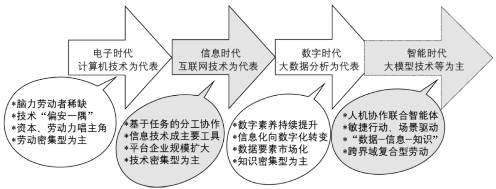 |  |

> 注：原文标注 25 个图例，本页收录前 15 个示例（约 27 张图），其余请至原文查看。
