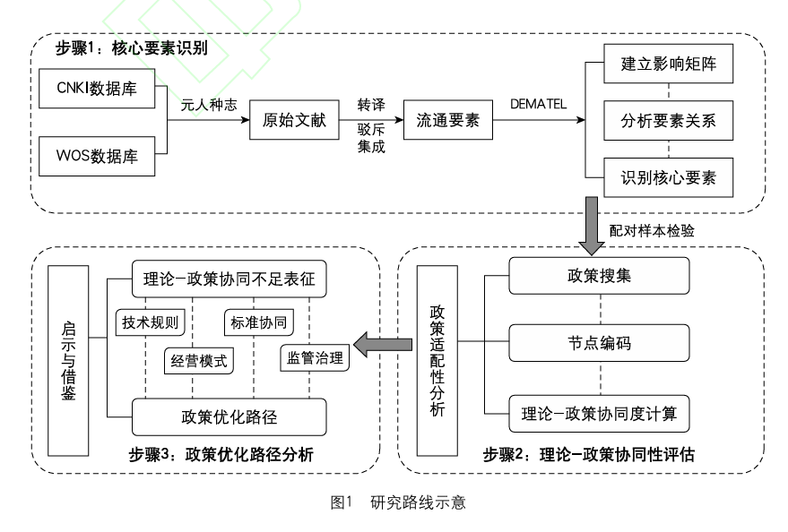

# 【学术图例】电子政务——6 个分析框架

> 来源：微信公众号「赫尔墨斯的公共管理百宝袋」（制 2025-08-27）
> 原文：http://mp.weixin.qq.com/s?__biz=MzkxMzQ1MjM5OQ==&mid=2247497938&idx=1&sn=955dae99b060ab4d55687c947aeb5399
> ⚠️ 图片版权归原作者与期刊所有，仅作学术索引。

## 1. 杨铃, 蒙士芳, 李燕. "权力-算法"适应性生存：超大城市城中村智慧治理中的人机共治机制——以天津市T村为例 [J/OL]. 电子政务, 1-17.

基于行动者网络理论和街头官僚理论，构建 **"技治势差—利益转译—双权互适"** 分析框架：人工智能重构社区治理网络，街头官僚在技术规则下通过"合规性变通"维持权力韧性；人机共治的本质是以算法权力与行政权力动态制衡为特点的"有监督的自主性"机制。

## 2. 刘旭. 塑权以增能：数治平台承接城市治理重心下移的内在机理——以上海"一网统管"街镇平台为例 [J/OL]. 电子政务, 1-14.

## 3. 赵淼, 刘银喜. 公共价值共创何以弥合老年数字鸿沟？——基于上海市"数字伙伴计划"的案例研究 [J/OL]. 电子政务, 1-13.

四阶段框架（基于 Bozeman 公共价值失灵框架）：
1. **公共价值失灵阶段**：识别数字政府建设中的价值失灵（价值传达与聚合机制失灵、不完全垄断、供应商稀缺、短视效应、利益囤积、威胁人权与尊严等表征）；
2. **公共价值确立阶段**：政府主导，通过政策响应与社会沟通聚合多元诉求，确立数字包容的共识性价值目标；
3. **公共价值共创阶段**：政府、企业、社会组织、公民协同行动、资源互补、知识共享、共同学习，共同设计解决方案；
4. **公共价值实现阶段**：方案通过资源整合与技术赋能触达老年群体，产生实际效益。

## 4. 钱锦琳, 夏义堃, 王雪. "理论-政策"协同视角下欧盟数据空间政策研究：适配性诊断与中国镜鉴 [J/OL]. 电子政务, 1-13.

## 5. 武小龙, 曾颖, 李烊. 全过程技术控制：村级小微权力监督何以有效的解释框架——基于H市S村智慧印章的案例分析 [J/OL]. 电子政务, 1-12.

## 6. 罗娟, 夏克婷, 黄池越, 等. 超大城市老龄群体数字融入的空间治理研究：现实困境、理论架构与机制建构 [J/OL]. 电子政务, 1-14.

四理论组合架构：
- **复杂系统理论**（宏观协同与动态调控）：超大城市="技术—资源—人口—政策"相互关联的复杂巨系统；
- **空间正义理论**（空间资源分配公平）：关注"技术先进区"与"数字洼地"的空间分异；
- **技术接受模型 TAM**（个体行为模式）："感知易用性"与"感知有用性"双维度，认知评估→行为转化的微观路径；
- **社会支持理论**（社会关系网络）：构建"家庭—社区—社会"三维支持网络。
