# 12个机制与分析框架直接用！MPA公共管理论文公共服务研究模型图

> 来源：微信公众号「百川研究生论文一站式指导」（2025-05-26）
> 原文：http://mp.weixin.qq.com/s?__biz=MzkwNzQzMTg3OQ==&mid=2247493915&idx=1&sn=7a0b53a16457147b8feb8ec2a9f26239
> ⚠️ 图片版权归原作者与期刊所有，仅作学术索引；引用请引原始论文。

> 注：完整收录：12 组 24 张（经浏览器全文提取）。

## 🌰1.郑楠楠,杨丹. 非常态情境下的公共服务集体合作生产及其机制——以上海市X区Q村志愿者俱乐部为例[J]. 秘书,2023(3):31-43.

| 图1 | 图2 |
|---|---|
|  |  |

## 🌰2.黄六招, 梁艳. 行动网络与共同生产：社区“小事”治理何以可能？——以“解忧超市”为例[J]. 秘书, 2024, 42(3): 27-41.

| 图1 | 图2 |
|---|---|
|  |  |

## 🌰3.钟晓华.共同生产何以推动社区治理共同体建构？——基于广州市J街道的实践考察[J].中国行政管理,2024,40(09):110-120.

| 图1 | 图2 |
|---|---|
|  |  |

| 图3 | 图4 |
|---|---|
|  |  |

| 图5 |
|---|
|  |

## 🌰4.王洪川，齐云清，侯云潇．智慧共同生产：数字技术重塑乡村公共服务机制研究[J/OL]．电子政务.

| 图1 |
|---|
|  |

## 🌰5.李风山，文宏. 数字技术赋能公共服务合作生产：内在逻辑、现实挑战与未来向度[J]. 电子政务，2024(09): 65-78.

| 图1 | 图2 |
|---|---|
| 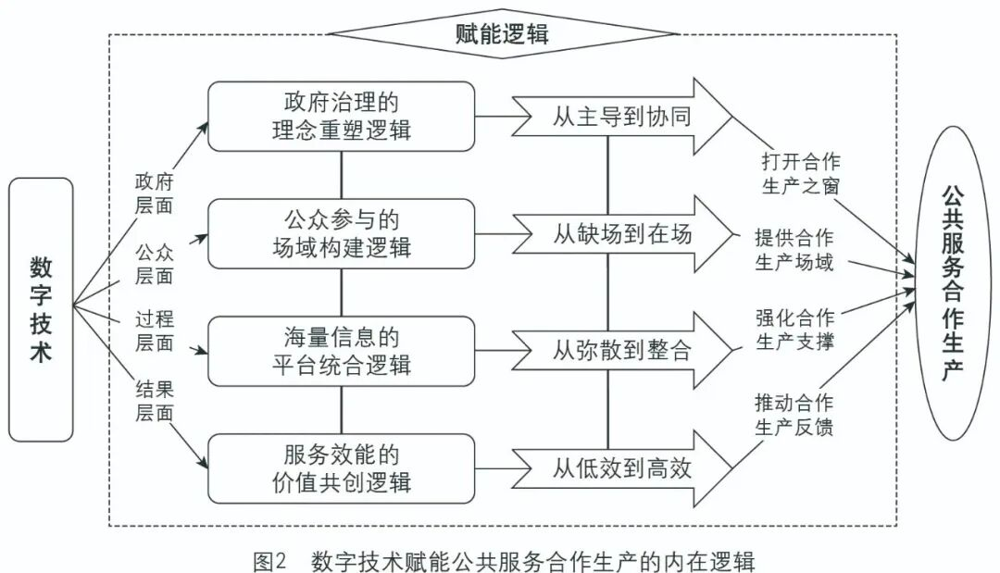 | 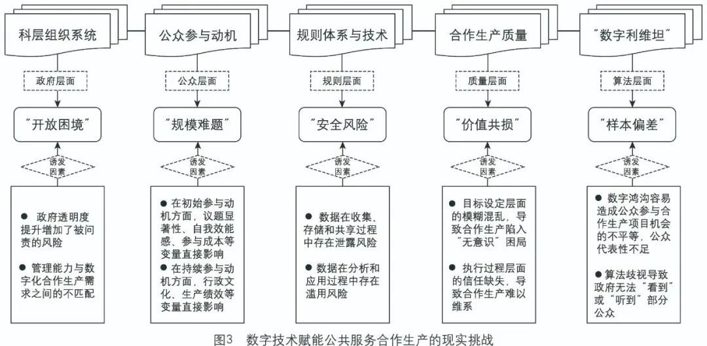 |

## 🌰6.潘莉, 孙洁, 王晔安. 合作生产视角下乡镇社会工作站促建社区韧性的机制研究——以望城“禾计划”项目为例[J]. 社会工作与管理, 2022, 22(4): 75-85.

| 图1 | 图2 |
|---|---|
|  | 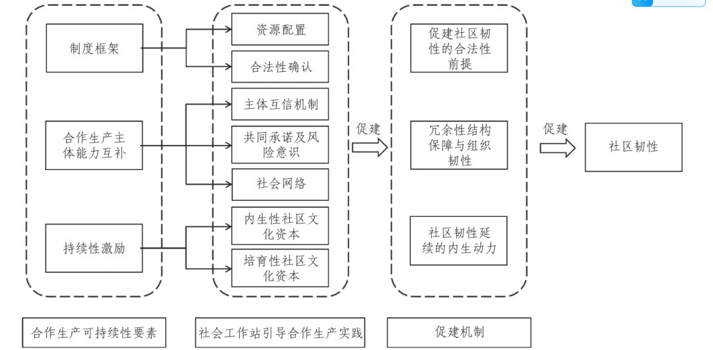 |

## 🌰7.张友浪, 冉宇豪. 多元协同治理如何助力公共服务合作生产?——基于R县“村超”赛事的制度分析[J]. 治理研究, 2024, 40(2): 57-72.

| 图1 | 图2 |
|---|---|
| 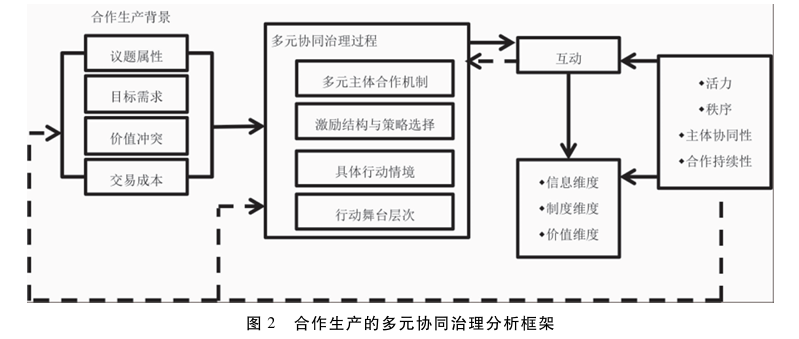 | 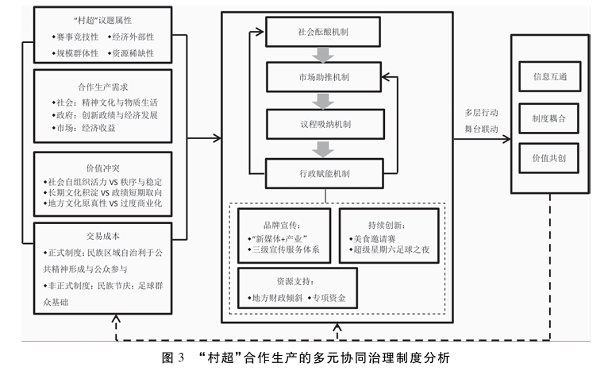 |

| 图3 |
|---|
| 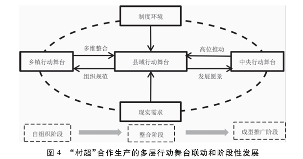 |

## 🌰8.侯俊东, 栾雅慧. 社区志愿服务共同生产：内涵逻辑及过程机理[J]. 社会工作与管理, 2024, 24(1): 1-10.

| 图1 |
|---|
| 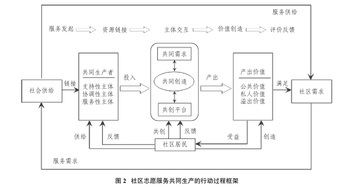 |

## 🌰9.朱火云,丁煜.农村互助养老的合作生产困境与路径优化——以X市幸福院为例[J].南京农业大学学报(社科版),2021,21(02):62-72.

| 图1 |
|---|
| 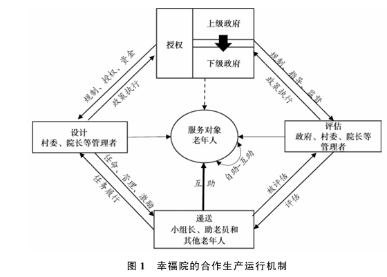 |

## 🌰10.吴月. “共同生产”如何达成——基于城市社区公共服务的实证研究[J]. 华南师范大学学报（社会科学版）, 2022, (5): 31-42.

| 图1 |
|---|
| 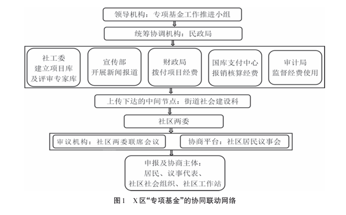 |

## 🌰11.王光海. 基于共同生产理论的社区治理共同体建构实践[J]. 西华大学学报（哲学社会科学版）,2024,43(5):77-88.

| 图1 | 图2 |
|---|---|
| 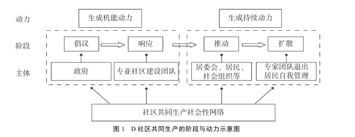 | 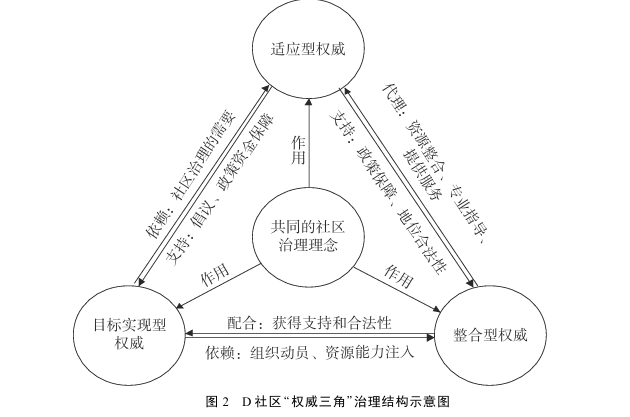 |

| 图3 |
|---|
| 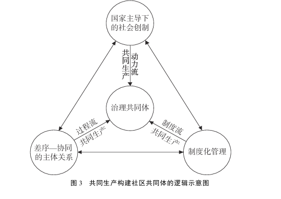 |

## 🌰12.吴金鹏. 公民共同生产行为：文献评述、研究框架与未来展望[J]. 公共管理与政策评论, 2022, 11(6): 156-166.

| 图1 |
|---|
| 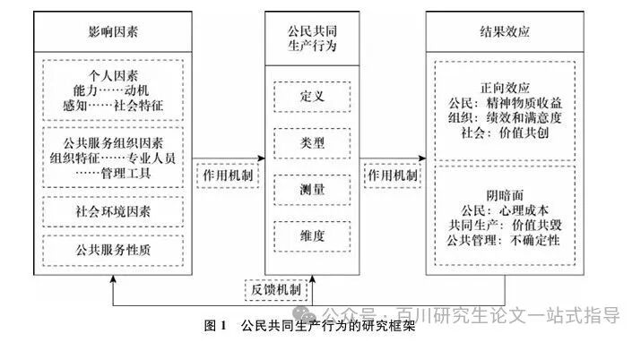 |
