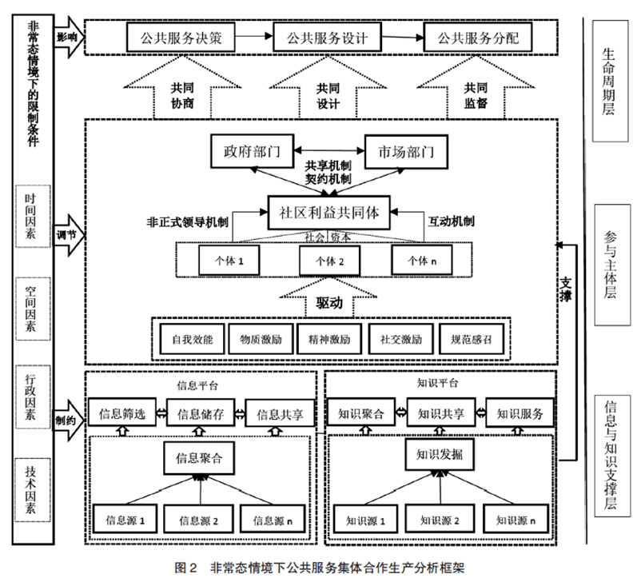
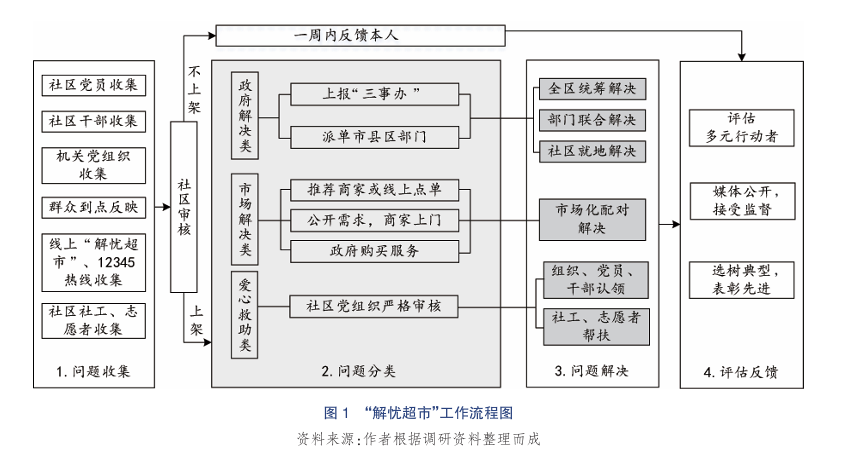
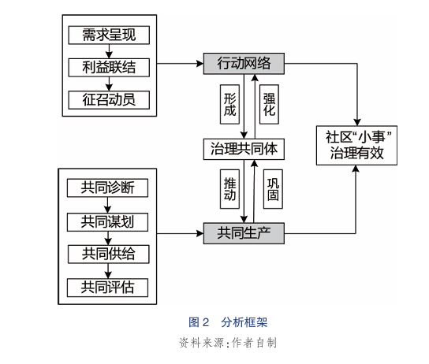
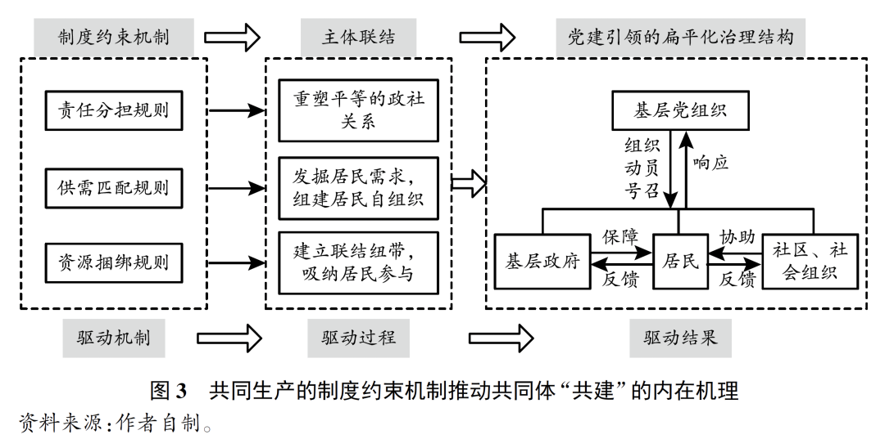
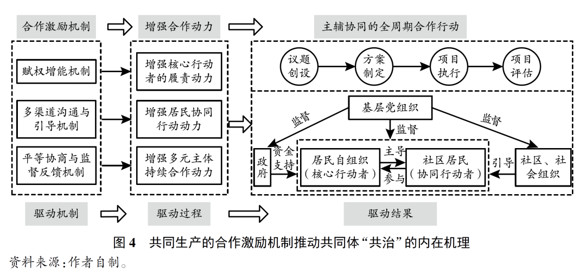
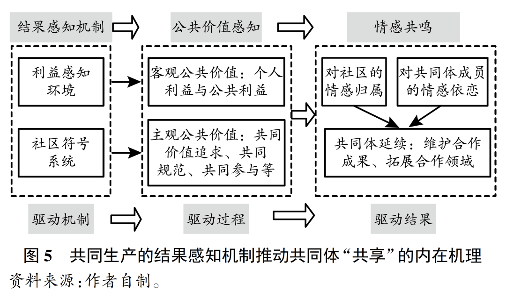
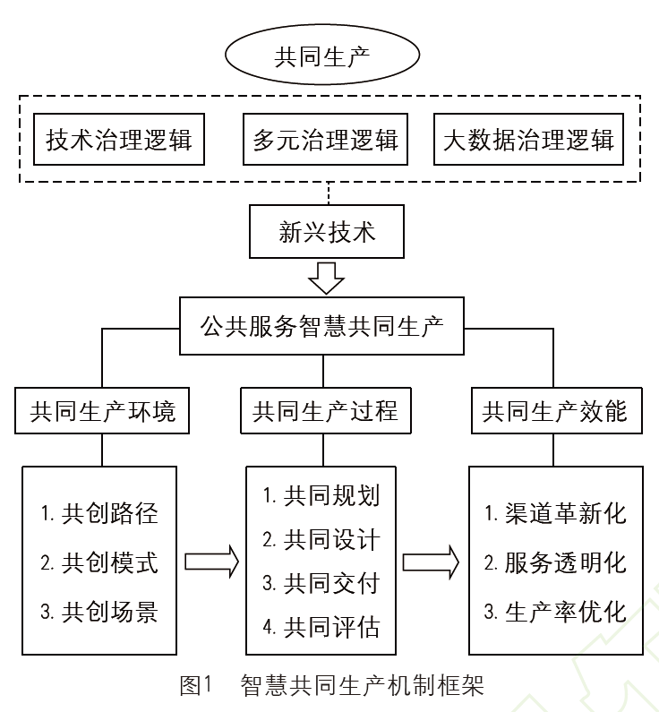
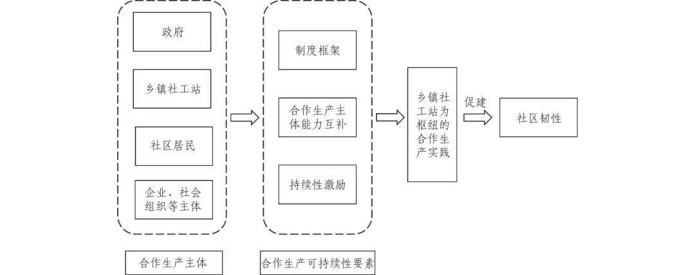

# 【学术图例】公共服务与合作生产研究——12 个机制与分析框架（来源：百川研究生论文一站式指导）

> 来源：微信公众号「百川研究生论文一站式指导」（2025-05-26）
> 原文：http://mp.weixin.qq.com/s?__biz=MzkwNzQzMTg3OQ==&mid=2247493915&idx=1&sn=7a0b53a16457147b8feb8ec2a9f26239
> ⚠️ 图片版权归原作者与期刊所有，仅作学术索引；引用请引原始论文。

> 注：原文标注 12 个图例；本页收录 5 组 12 张（原文第 1 例及后续条目因抓取限制未收录，请至原文查看）。

## 🌰2. 黄六招, 梁艳. 行动网络与共同生产：社区“小事”治理何以可能？——以“解忧超市”为例 [J]. 秘书, 2024, 42(3): 27-41.

|  |  |
|---|---|

## 🌰3. 钟晓华. 共同生产何以推动社区治理共同体建构？——基于广州市 J 街道的实践考察 [J]. 中国行政管理, 2024, 40(09): 110-120.

|  |  |
|---|---|
|  |  |
|---|---|
|  |
|---|

## 🌰4. 王洪川, 齐云清, 侯云潇. 智慧共同生产：数字技术重塑乡村公共服务机制研究 [J/OL]. 电子政务.

|  |
|---|

## 🌰5. 李风山, 文宏. 数字技术赋能公共服务合作生产：内在逻辑、现实挑战与未来向度 [J]. 电子政务, 2024(09): 65-78.

|  |  |
|---|---|

## 🌰6. 潘莉, 孙洁, 王晔安. 合作生产视角下乡镇社会工作站促建社区韧性的机制研究——以望城“禾计划”项目为例 [J]. 社会工作与管理, 2022, 22(4): 75-85.

|  |  |
|---|---|
