# 【学术图例】公共政策理论研究——26 个机制与分析框架（来源：百川研究生论文一站式指导）

> 来源：微信公众号「百川研究生论文一站式指导」（2025-06-11）
> 原文：http://mp.weixin.qq.com/s?__biz=MzkwNzQzMTg3OQ==&mid=2247494002&idx=1&sn=4b1c67a93d2f4697cf7bc16099adc568
> ⚠️ 图片版权归原作者与期刊所有，仅作学术索引；引用请引原始论文。

> 注：原文标注 26 个图例；本页收录前 11 组 19 张（原文抽取限制，其余请至原文查看）。

## 🌰1. 李杰. 公共政策设计的优化：嵌入渐进主义决策模型——以上海市社区事务受理服务中心为例 [J]. 江汉大学学报(社会科学版), 2017, 34(3): 51-60.

| 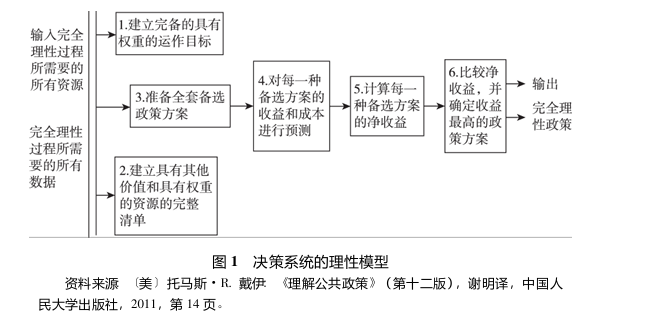 | 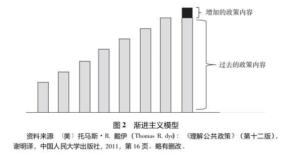 |
|---|---|
| 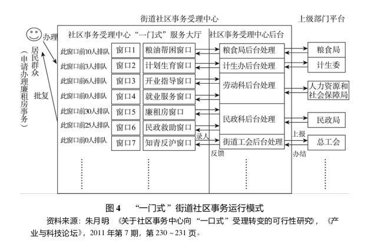 | 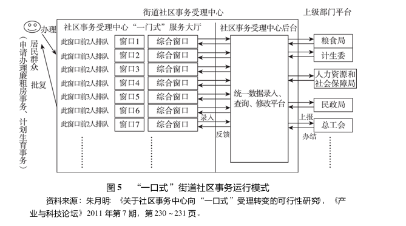 |
|---|---|

## 🌰2. 李利宏, 王欢子, 曹静静. “漏斗”分析框架下政策执行“最后一公里”问题研究——以 S 省 D 县 J 乡农村厕所革命为例 [J]. 中共福建省委党校(福建行政学院)学报, 2024(05): 75-86.

| 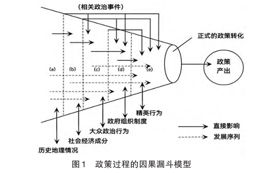 | 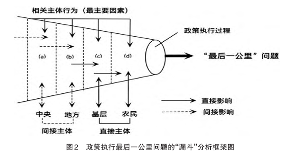 |
|---|---|

## 🌰3. 钟裕民. 双层互动决策模型：近十年来中国政策过程的一个解释框架 [J]. 南京师大学报(社会科学版), 2018(04): 53-61.

| 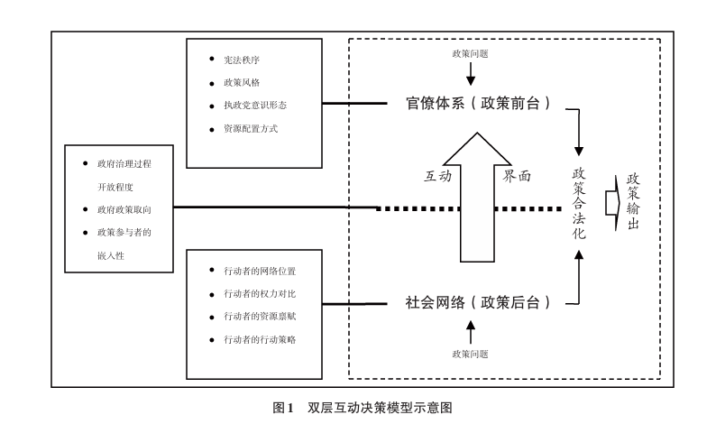 |
|---|

## 🌰4. 李伟权, 黄扬. 政策执行中的刻板印象：一个“激活-应用”的分析框架 [J]. 公共管理学报, 2019, 16(03): 1-15+168.

| 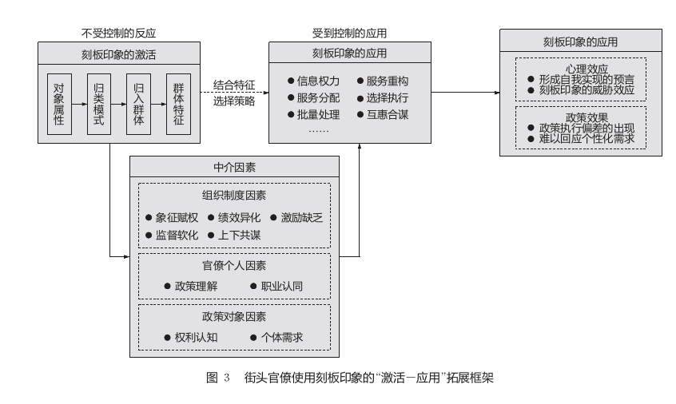 |
|---|

## 🌰5. 傅利平, 陈琴, 董永庆. 模糊冲突性政策特征何以影响我国公共政策执行——基于精准扶贫政策的文本量化分析 [J]. 中国农村研究, 2022(2): 78-98.

| 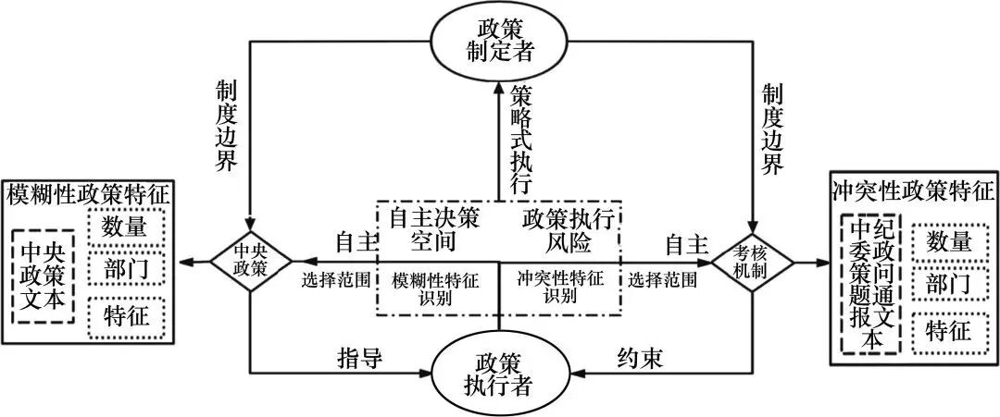 | 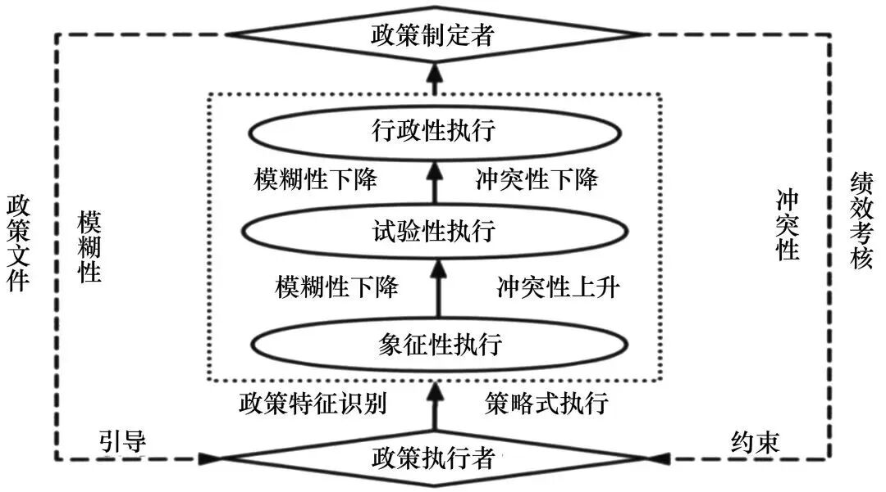 |
|---|---|

## 🌰6. 李娉, 杨宏山. 科学检验与多元协商：政策试验中的知识生产路径——基于 Y 市垃圾分类四项试点的比较分析 [J]. 公共管理学报, 2022, 19(03): 71-83+170.

| 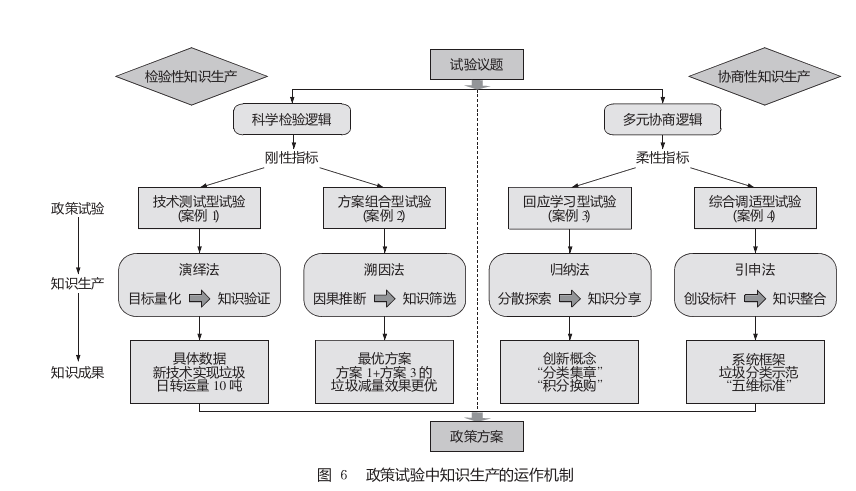 | 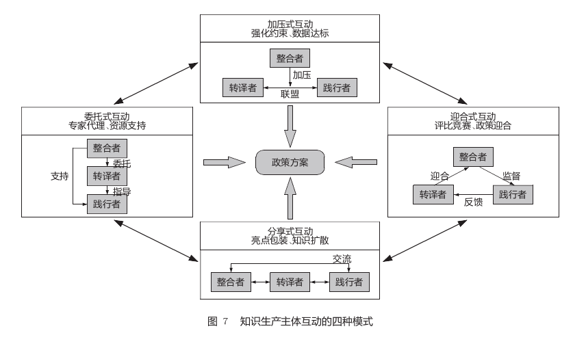 |
|---|---|

## 🌰7. 袁方成, 范静惠. 政策执行模式的转换及其逻辑——一个拓展的“模糊-冲突”框架 [J]. 中国行政管理, 2022(03): 13-21.

| 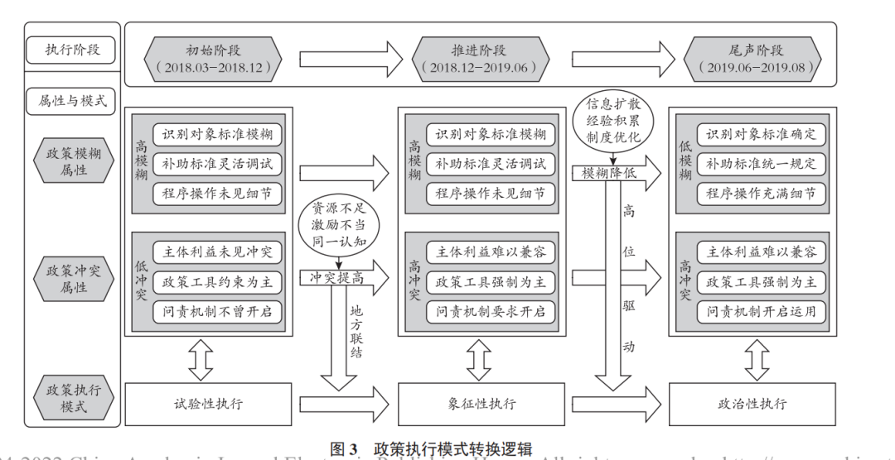 |
|---|

## 🌰8. 杨书文, 薛立强. 县级政府如何执行政策？——基于政府过程理论的“四维框架”实证研究 [J]. 公共管理学报, 2021, 18(03): 76-85+172.

| 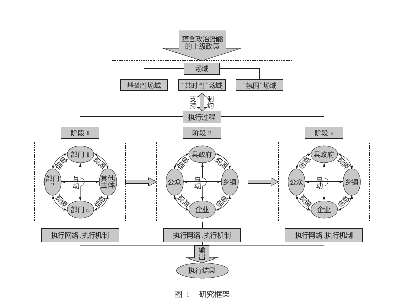 |
|---|

## 🌰9. 王法硕, 陈泠. 社会治理智能化创新政策为何执行难？——基于米特-霍恩模型的个案研究 [J]. 电子政务, 2020(05): 49-57.

| 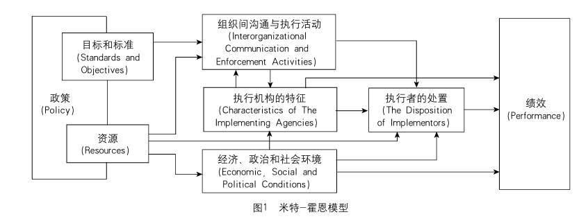 |
|---|

## 🌰10. 薛澜, 赵静. 转型期公共政策过程的适应性改革及局限 [J]. 中国社会科学, 2017(9): 45-67.

| 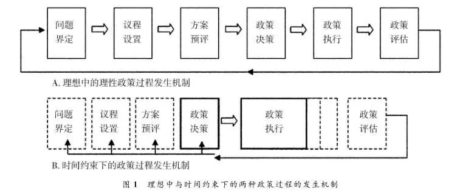 | 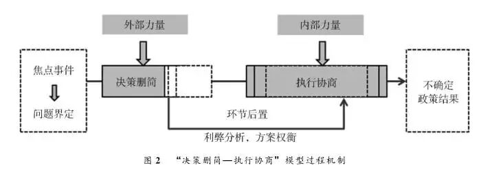 |
|---|---|

## 🌰11. 万筠, 林婧淇. “非渐进式”政策执行阻滞何以消解？——基于“决策模糊-执行协商”分析框架的多案例研究 [J]. 秘书, 2024(1): 56-72.

| 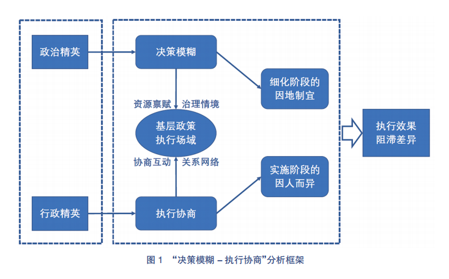 | 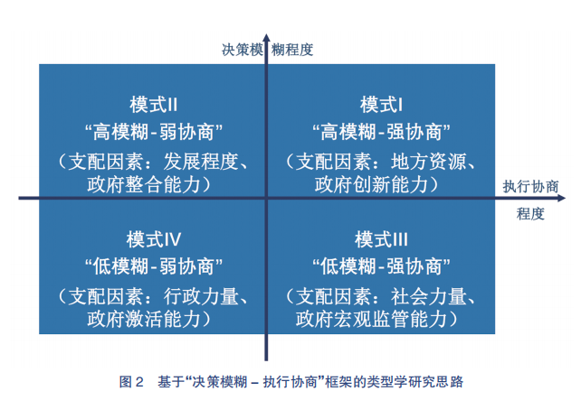 |
|---|---|
