# 【学术图例】韧性社区治理研究——11 个机制与分析框架

> 来源：微信公众号「百川研究生论文一站式指导」（2025-07-29）
> 原文：http://mp.weixin.qq.com/s?__biz=MzkwNzQzMTg3OQ==&mid=2247494228&idx=2&sn=dc6c4045dfaf9970ca8c075e60991760
> ⚠️ 图片版权归原作者与期刊所有，仅作学术索引；引用请引原始论文。

> 注：完整收录：11 组 28 张（经浏览器全文提取）。

## 🌰1. 何兰萍, 曹慧媛. 韧性思维嵌入治理现代化的政策演进及结构层次 [J]. 江苏社会科学, 2023(01): 132-141.

| 图1 | 图2 |
|---|---|
| 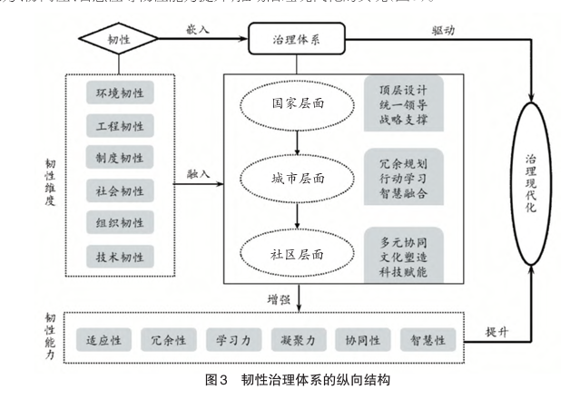 | 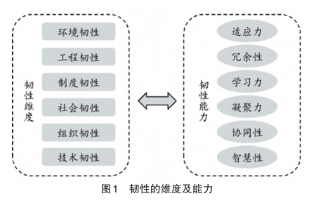 |

| 图3 |
|---|
| 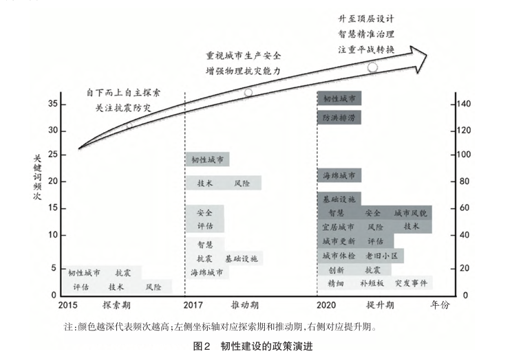 |

## 🌰2. 构建中国式现代化的城市社区韧性治理新探索——基于“吸收—传导—转化”的分析

| 图1 | 图2 |
|---|---|
| 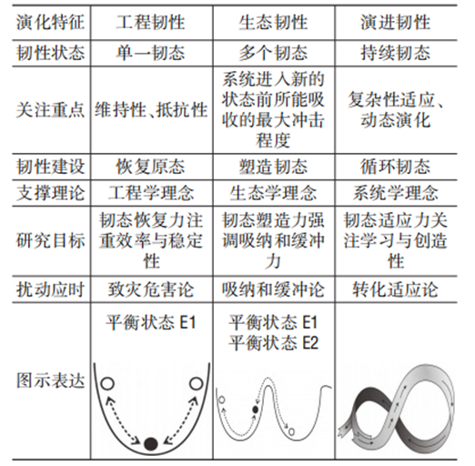 | 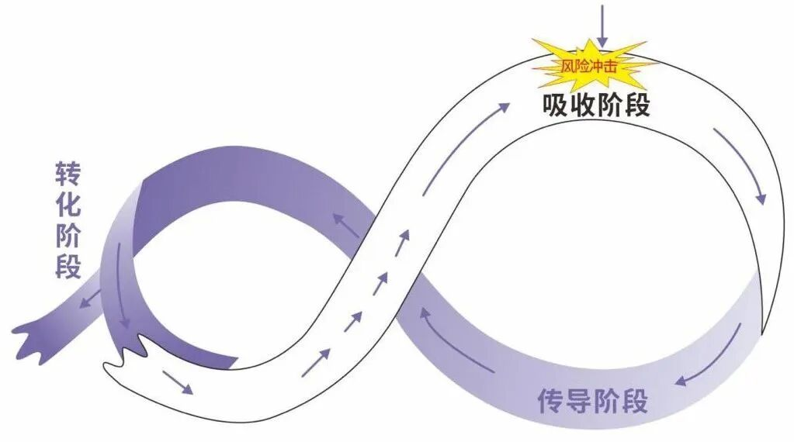 |

## 🌰3. 风险视域下如何建设韧性社区治理共同体：目标、路径与任务——基于政治—价值—技术三维驱动的分析

| 图1 |
|---|
| 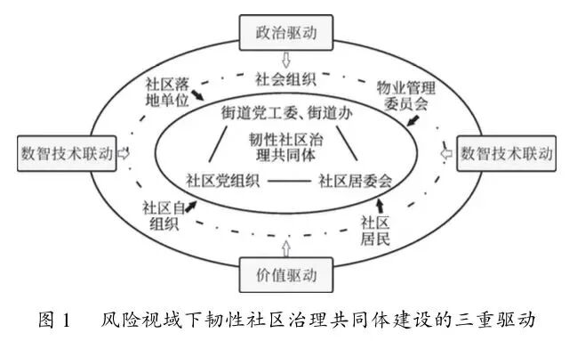 |

## 🌰4. 房亚明, 古慧琳. 组织韧性：城市社区风险治理的机制优化 [J]. 天津行政学院学报, 2024, 26(1): 64-74.

| 图1 | 图2 |
|---|---|
| 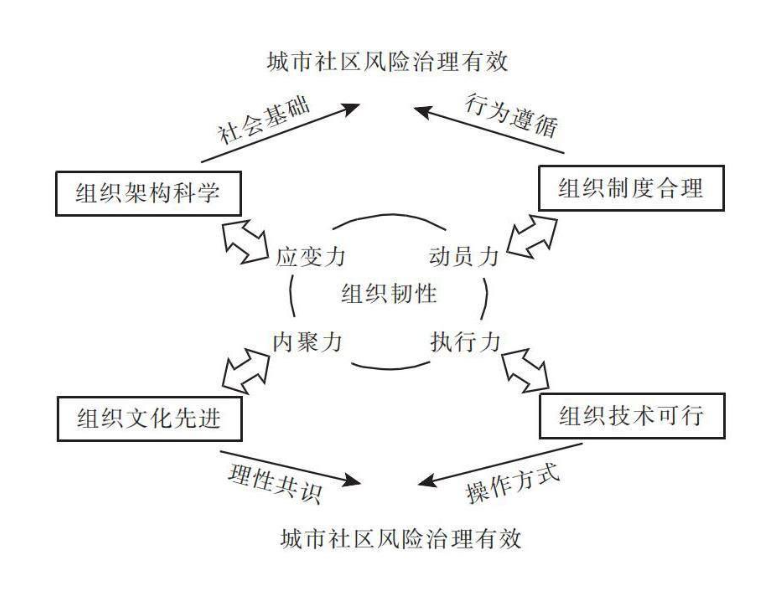 | 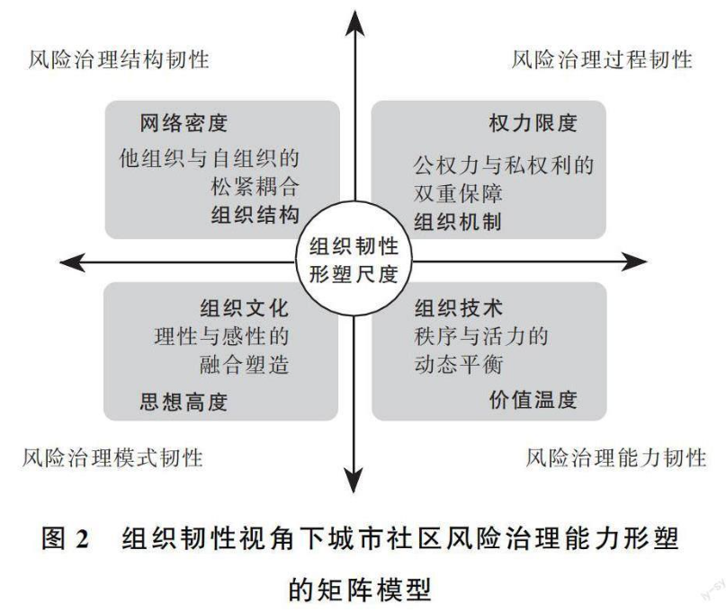 |

## 🌰5. 杨宏山, 张健培. “平急转换”：理解基层韧性治理的新视角 [J]. 四川大学学报(哲学社会科学版), 2024(3): 32-41.

| 图1 | 图2 |
|---|---|
| 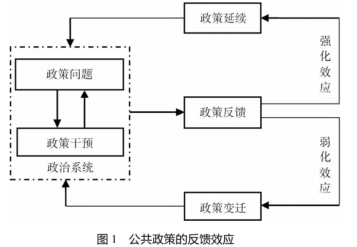 | 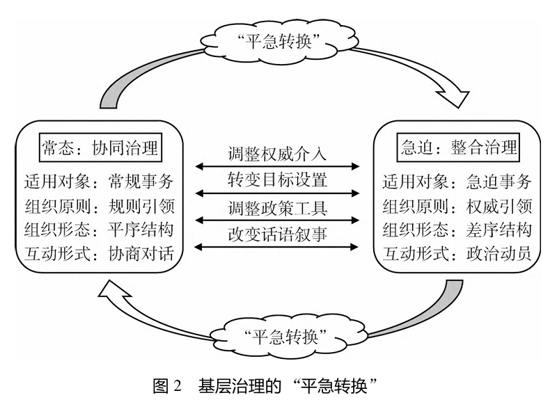 |

## 🌰6. 朱正威, 郭瑞莲, 袁玲. 新安全格局背景下城市安全韧性评价框架：探索与构建 [J]. 公共管理与政策评论, 2024, 13(3): 138-151.

| 图1 | 图2 |
|---|---|
| 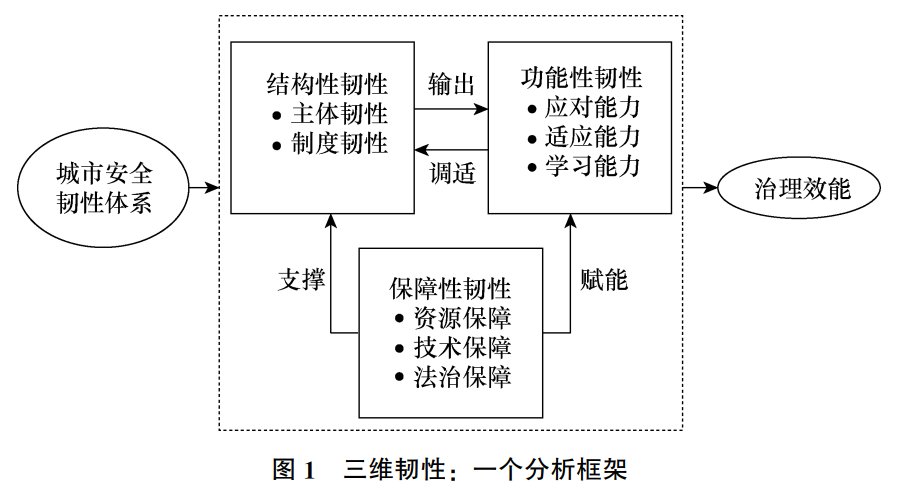 | 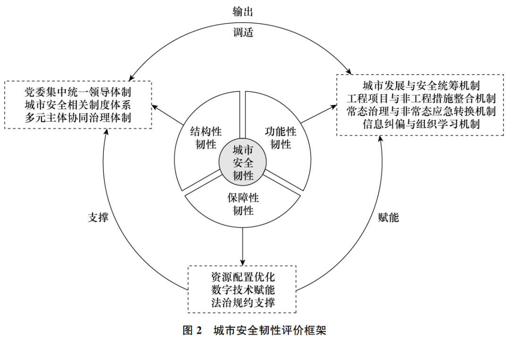 |

## 🌰7. 朱正威, 赵雅, 马慧. 从韧性城市到韧性安全城市：中国提升城市韧性的实践与逻辑 [J]. 南京社会科学, 2024(7): 53-65+77.

| 图1 |
|---|
| 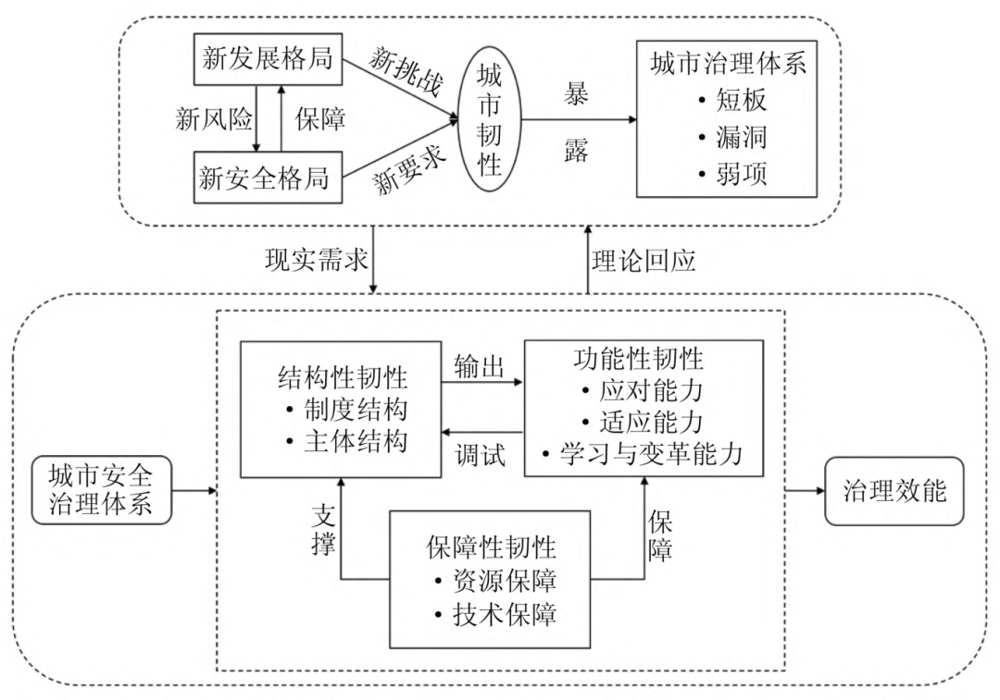 |

## 🌰8. 王薇然, 杜海峰. 基于多元治理主体的乡村韧性比较研究 [J]. 公共行政评论, 2021, 14(4): 1-24.

| 图1 | 图2 |
|---|---|
| 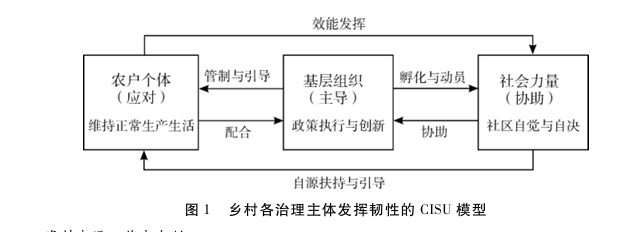 | 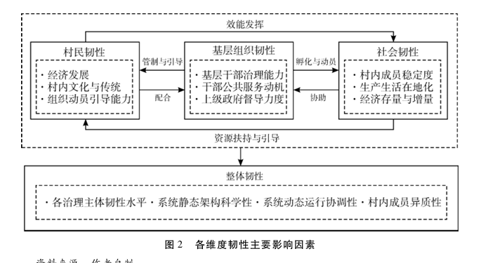 |

## 🌰9. 黄弘, 范维澄. 构建“安全韧性城市”：概念、理论与实施路径 [J]. 北京行政学院学报, 2024(2): 1-9.

| 图1 | 图2 |
|---|---|
| 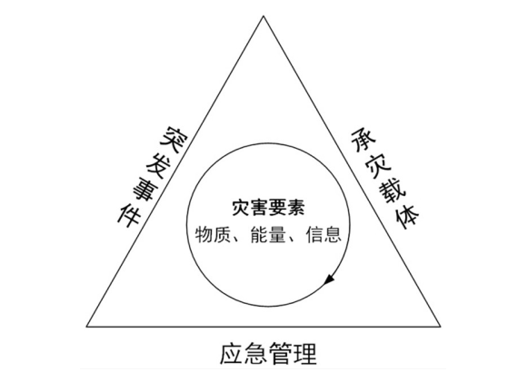 | 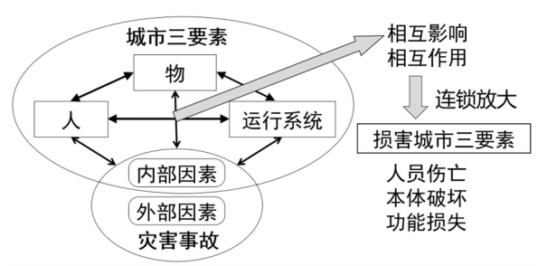 |

| 图3 | 图4 |
|---|---|
| 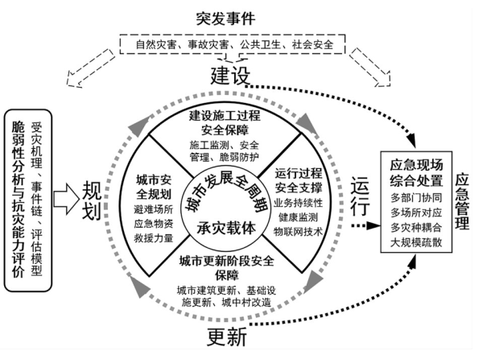 | 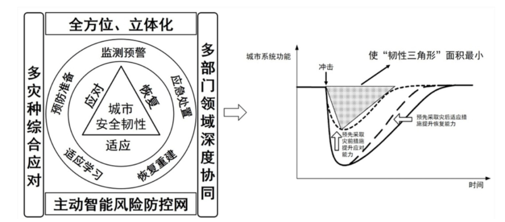 |

| 图5 | 图6 |
|---|---|
| 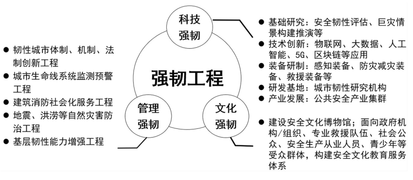 | 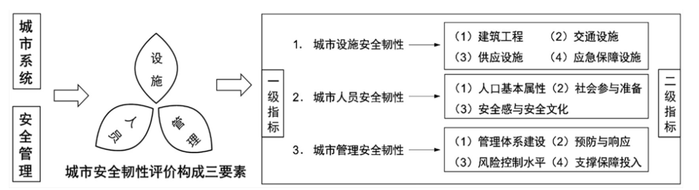 |

## 🌰10. 李志刚, 胡洲伟. 城市韧性研究：理论、经验与借鉴 [J]. 中国名城, 2021, 35(11): 1-12.

| 图1 | 图2 |
|---|---|
| 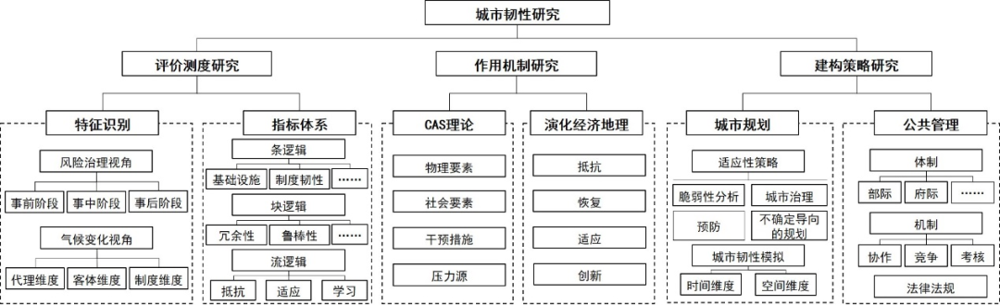 | 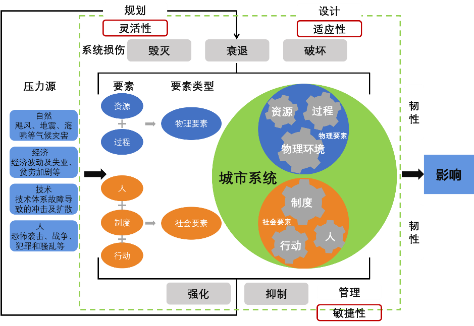 |

## 🌰11. 石龙宇, 郑巧雅, 杨萌, 刘玲玉. 城市韧性概念、影响因素及其评估研究进展 [J]. 生态学报, 2022, 42(14): 6016-6029.

| 图1 | 图2 |
|---|---|
| 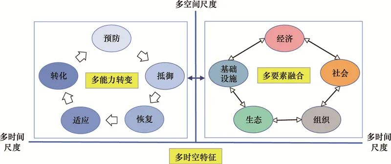 | 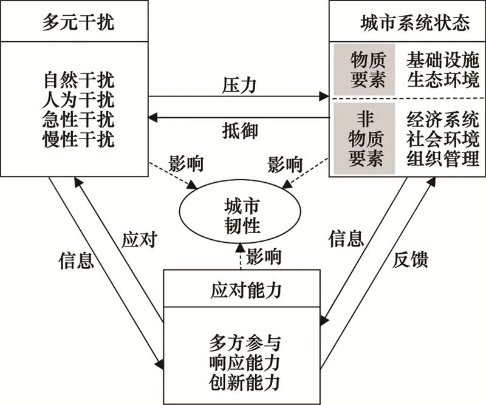 |

| 图3 | 图4 |
|---|---|
| 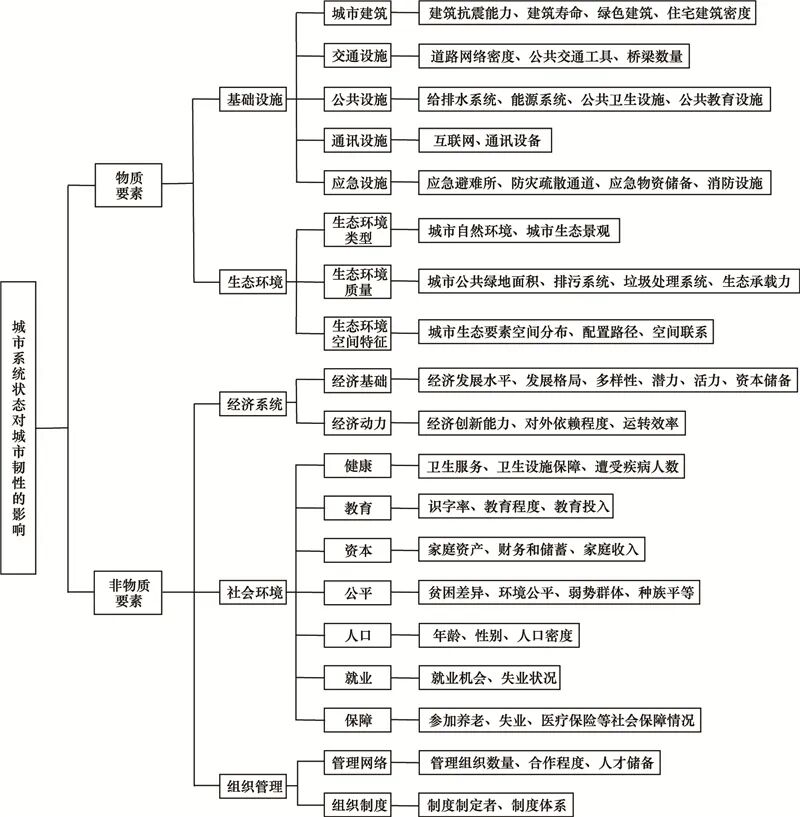 | 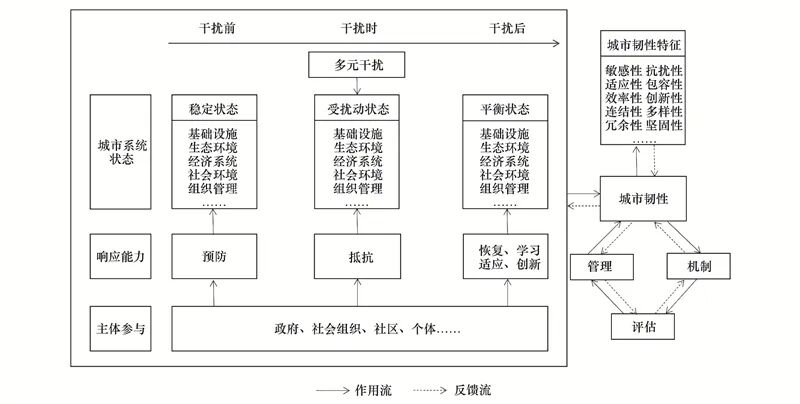 |
