# 【学术图例】行动者网络理论的应用研究——12 个机制与分析框架

> 来源：微信公众号「赫尔墨斯的公共管理百宝袋」（制 2025-07-01）
> 原文：http://mp.weixin.qq.com/s?__biz=MzkxMzQ1MjM5OQ==&mid=2247496925&idx=1&sn=ffbe3459f15e0ae1fdf4ec2d10633aff
> ⚠️ 图片版权归原作者与期刊所有，仅作学术索引；引用请注原文并遵守著作权法。

## 🌰1. 范德志, 武晗晗, 于水. 行动者网络参与数字乡村空间再造的实践过程与运作逻辑——基于浙江省W村的案例分析 [J/OL]. 兰州学刊, 1-12.

| 行动者网络理论视角下数字乡村空间生产的分析框架 | W村空间生产的行动者网络演进历程 |
| --- | --- |
| 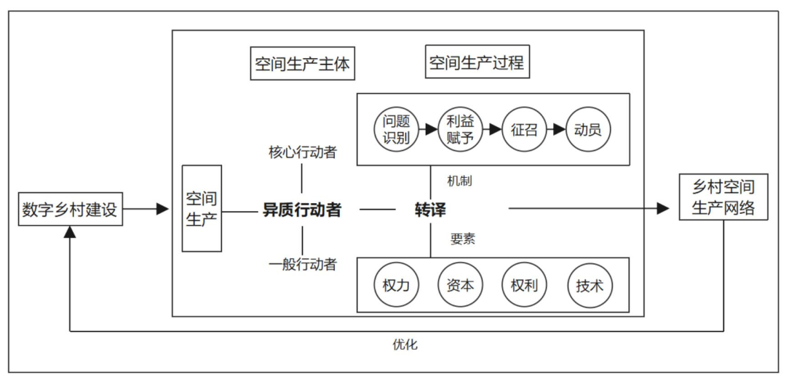 | 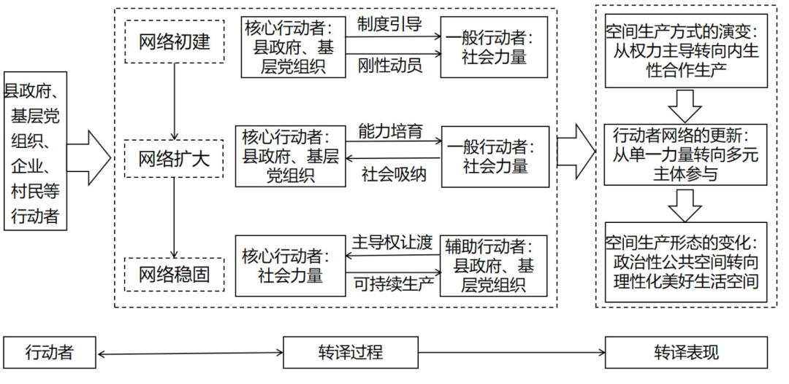 |

## 🌰2. 曹静晖, 颜慧芳. 行动者网络视角下乡贤组织赋能乡村治理的路径——基于湖南J村的案例分析 [J]. 华南理工大学学报(社会科学版), 2025, 27(03): 128-140.

| 乡贤组织行动者网络的分析框架 | J村乡贤组织构建的行动者网络 |
| --- | --- |
| 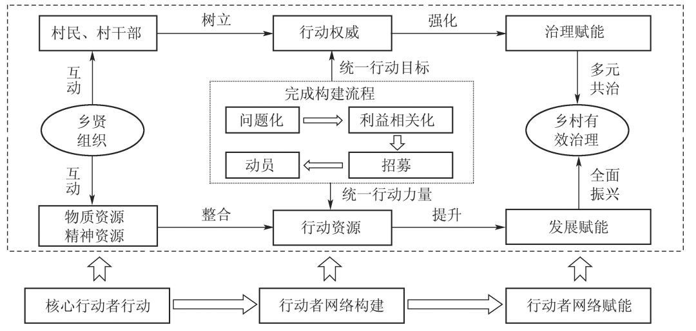 | 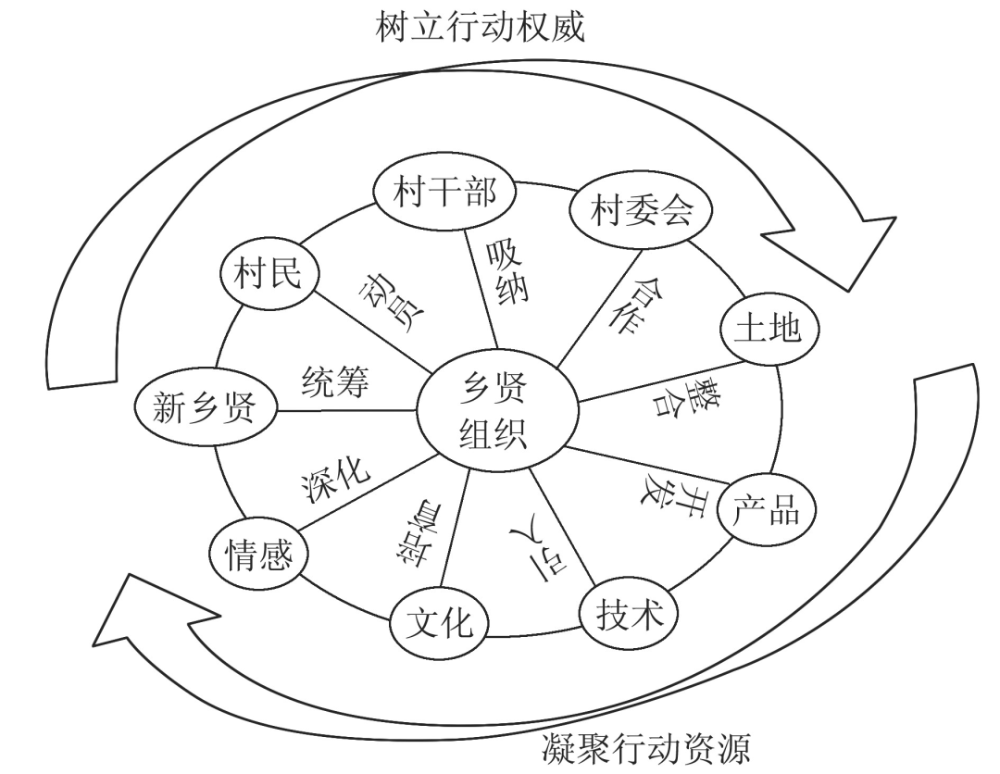 |

## 🌰3. 程叶青, 王婷, 黄政, 等. 基于行动者网络视角的乡村转型发展机制与优化路径——以海南中部山区大边村为例 [J]. 经济地理, 2022, 42(04): 34-43.

| 大边村转型发展行动者与强制通行点 | 大边村转型发展行动者网络 |
| --- | --- |
| 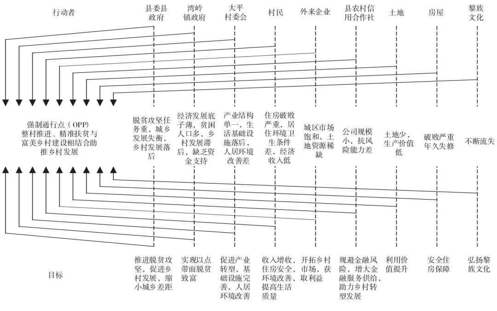 | 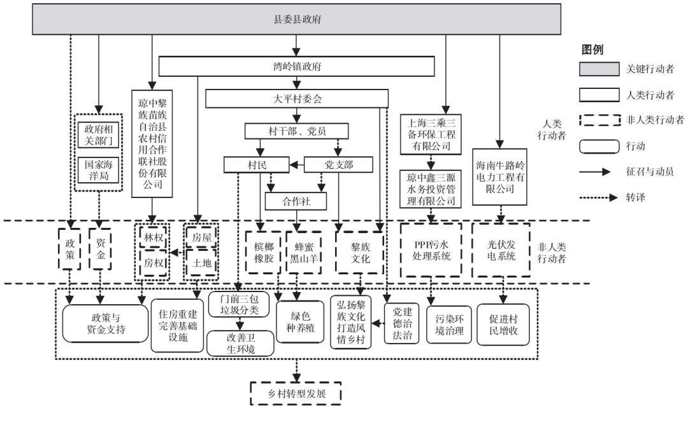 |

## 🌰4. 陈珊珊, 陈劲, 董巍. 传统能源产业如何实现绿色低碳转型？——基于行动者网络观的纵向案例研究 [J/OL]. 软科学, 1-16.

| 行动者网络理论在传统能源产业绿色低碳转型中的应用框架 | 大亚湾石化区绿色低碳转型动态合作网络 |
| --- | --- |
| 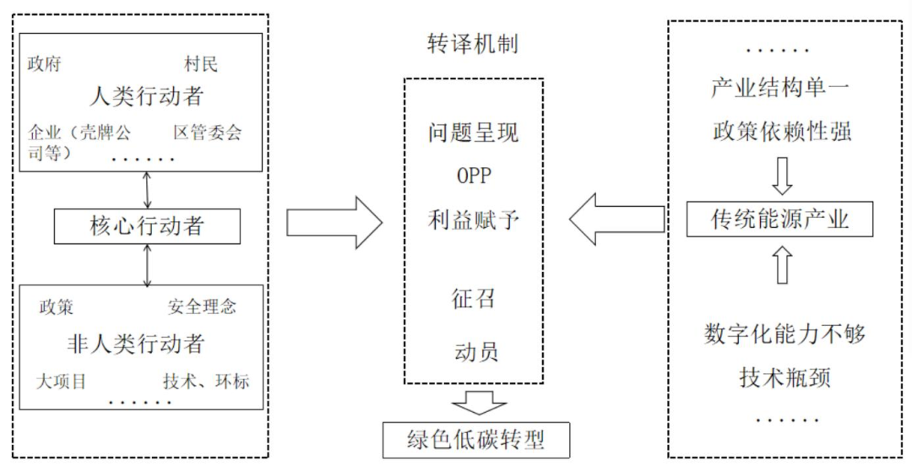 | 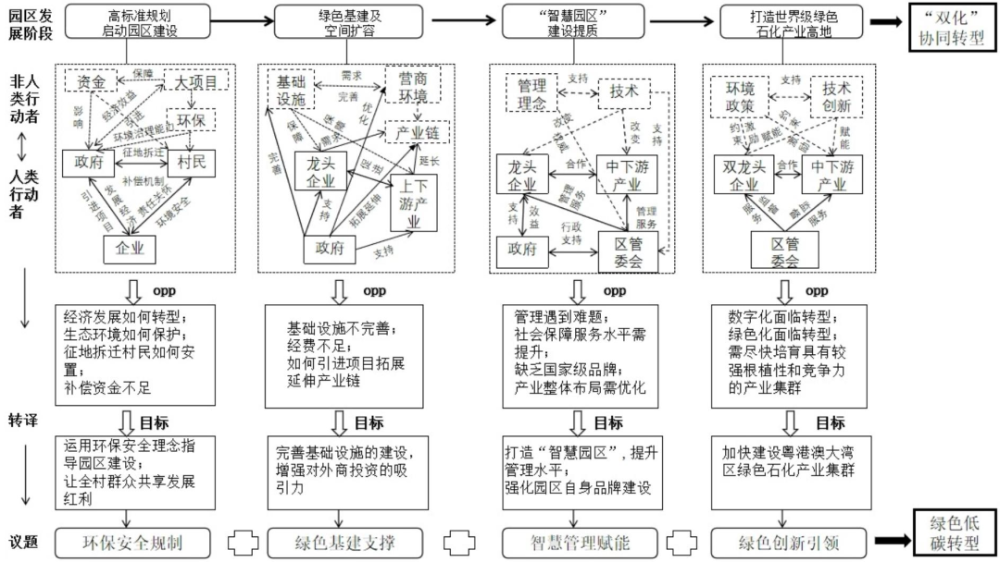 |

## 🌰5. 张桂蓉, 张颖. 新乡贤推动乡村产业振兴的过程研究——基于扎根理论的探索性案例分析 [J]. 农林经济管理学报, 2025, 24(02): 174-184.

| 乡村产业振兴行动者网络演化分析框架 | 乡村产业振兴行动者网络螺旋演化模型 |
| --- | --- |
| 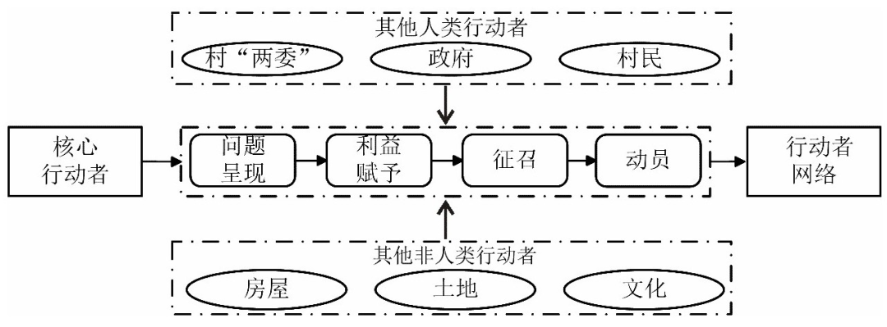 | 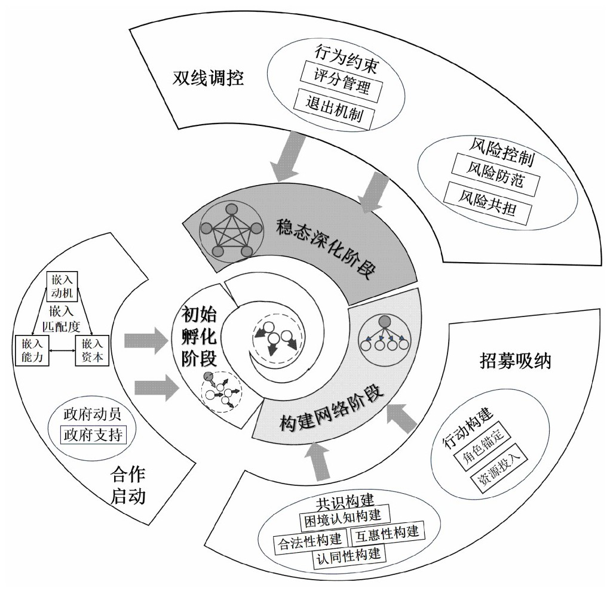 |

## 🌰6. 董毅, 曹海林. 乡村特色文化产业发展中行动者网络的建构机理——基于徐州市马庄村香包产业的考察 [J]. 中国农村观察, 2025, (01): 21-42.

| 香包产业"内生自主"发展阶段各行动者面临的问题、目标与强制通行点 | 香包产业"内生自主"发展阶段行动者网络示意 |
| --- | --- |
| 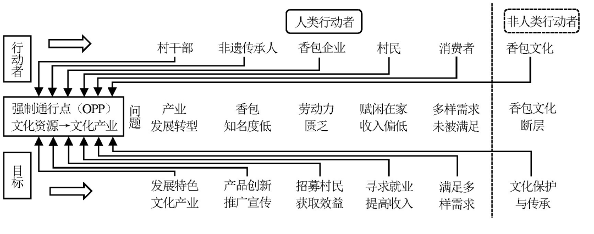 | 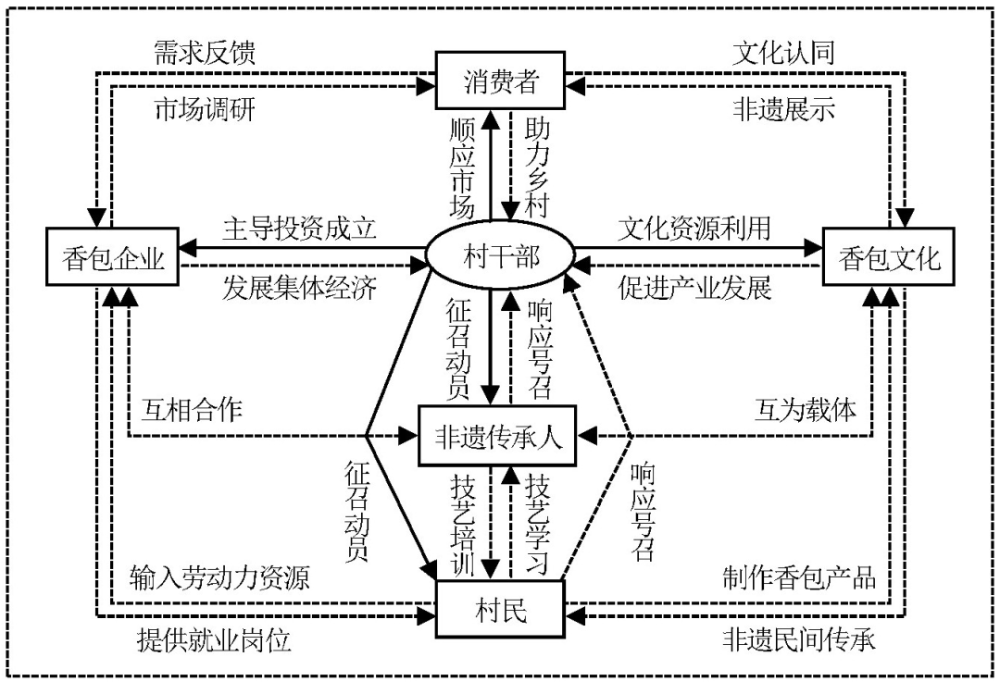 |
