# 【学术图例】数字治理与行政负担、地方治理改革与政策执行——15 个分析框架

> 来源：微信公众号「赫尔墨斯的公共管理百宝袋」（制 2025-06-29）
> 原文：http://mp.weixin.qq.com/s?__biz=MzkxMzQ1MjM5OQ==&mid=2247496780&idx=1&sn=df301b0aca3917e24cfc80b6b8992c4f
> ⚠️ 图片版权归原作者与期刊所有，仅作学术索引。

## 🌰1. 连宏萍, 邹佳秀. 数字技术嵌入异化下行政负担的生成与转移 [J]. 中国行政管理, 2025, 41(04): 30-42.

框架："技术嵌入—繁文缛节—基层工作人员行政负担—民众行政负担"。数字嵌入缺乏制度配套时催生繁文缛节，经科层纵向传导、横向传导、数字加码下沉为基层负担，再通过行政拖延、加码执行、推知责任、消极沟通转移至民众。

| 图1 | 图2 |
| --- | --- |
| 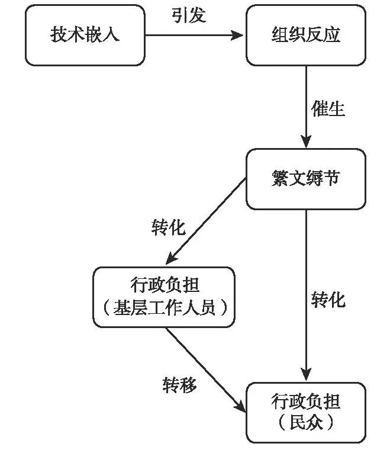 | 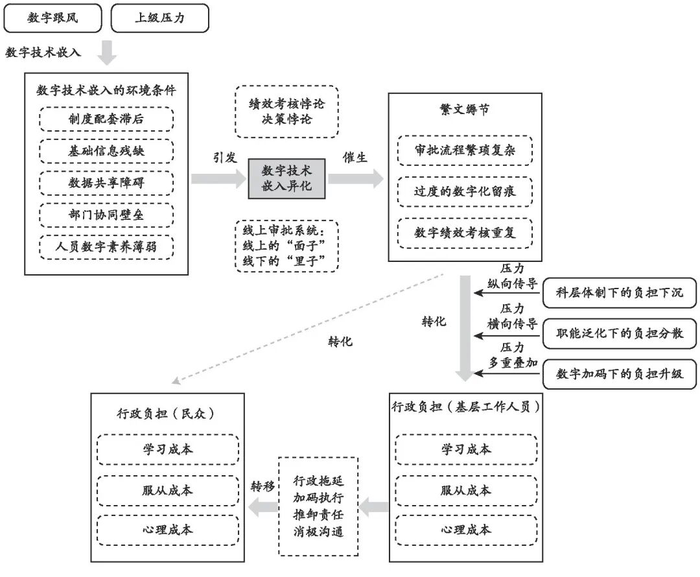 |

## 🌰2. 李欢欢, 李齐. 数字化消解行政负担的系统性策略与实现机制——基于"12345·临沂首发"的案例分析 [J]. 中国行政管理, 2025, 41(04): 43-55.

提炼出组织互补、技术互嵌、行动互利的实现机制。

| 图1 | 图2 | 图3 | 图4 |
| --- | --- | --- | --- |
| 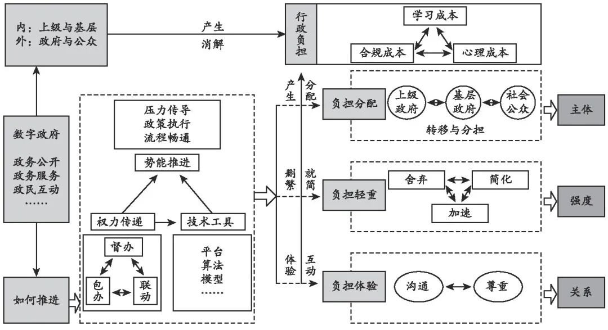 | 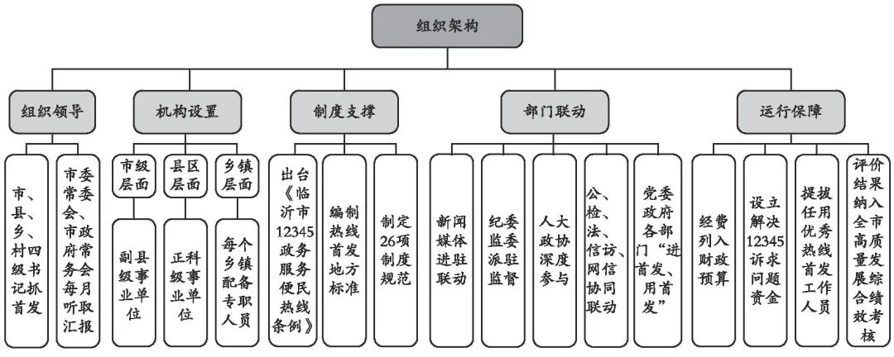 | 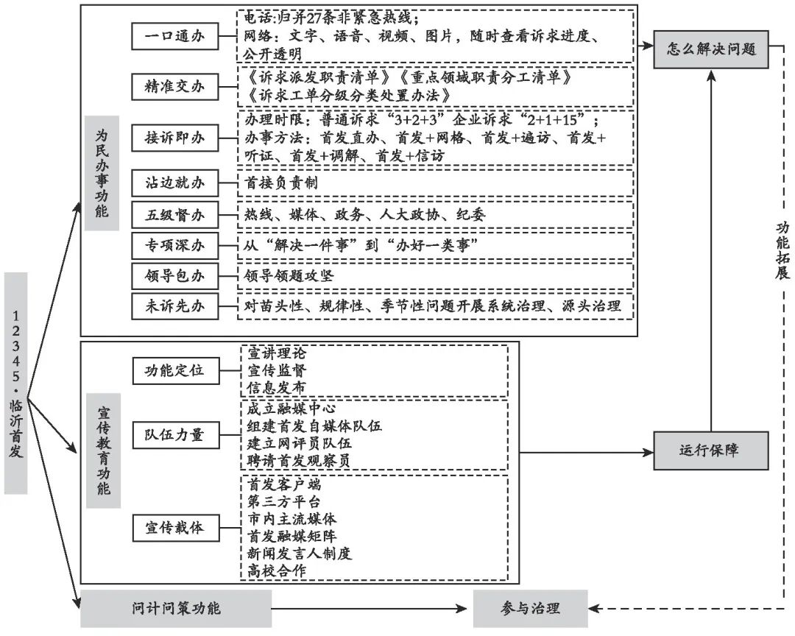 | 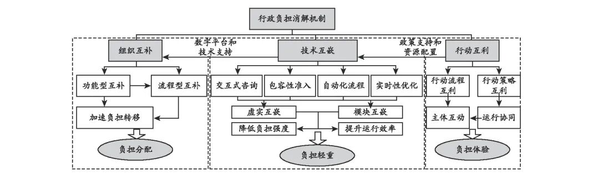 |

## 🌰3. 房瑞佳, 郑跃平, 赖玺滟. 数字技术缘何加重公民的行政负担?——一项系统性文献综述 [J/OL]. 公共管理评论, 1-21.

四条生成路径：①技术应用直接作用；②技术经政府行为的间接作用；③技术经公民感知的间接作用；④技术对政民互动关系的影响。

| 图1 | 图2 |
| --- | --- |
| 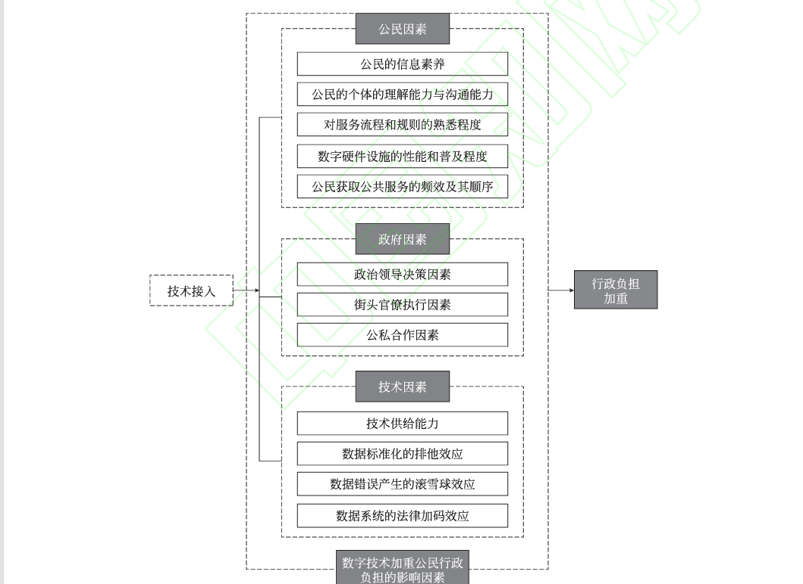 | 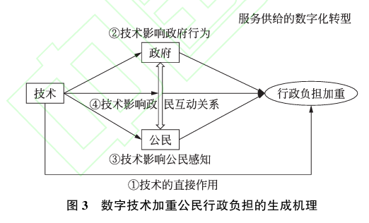 |

## 🌰4. 舒全峰, 杨晓婷, 刘璐. 智能社会治理何以产生数字倦怠——基于行政负担理论的分析 [J]. 中国行政管理, 2025, 41(01): 98-109.

合规成本+学习成本+心理负担 → 数字脱节、数字剥夺、情绪耗竭 → 数字倦怠。

| 图1 | 图2 | 图3 | 图4 |
| --- | --- | --- | --- |
| 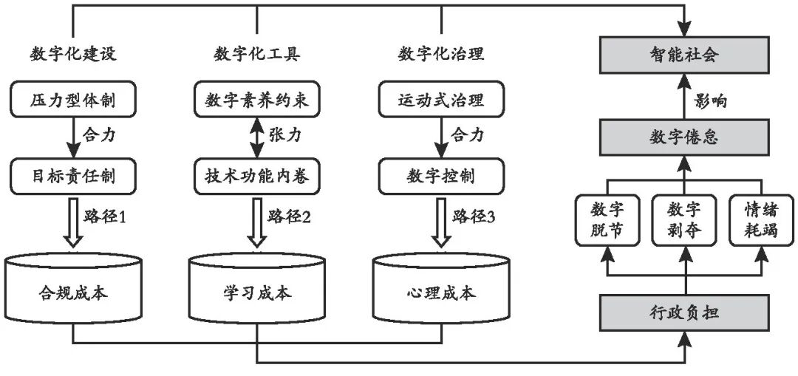 | 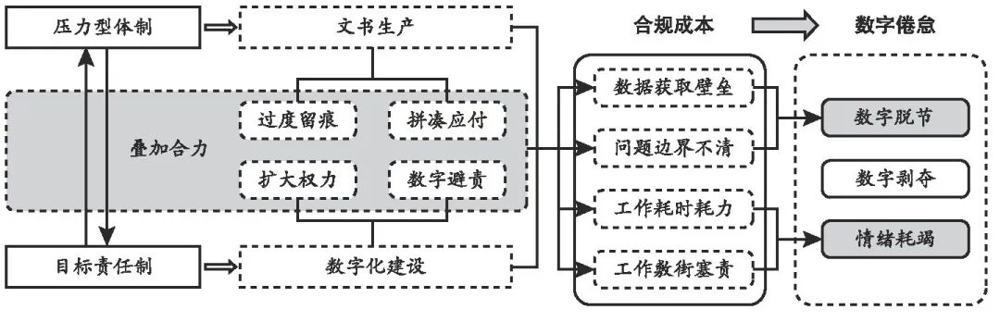 | 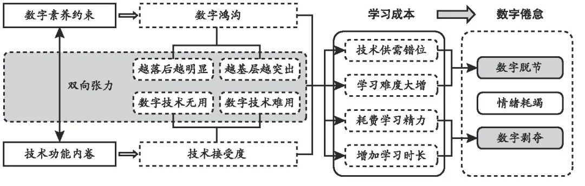 | 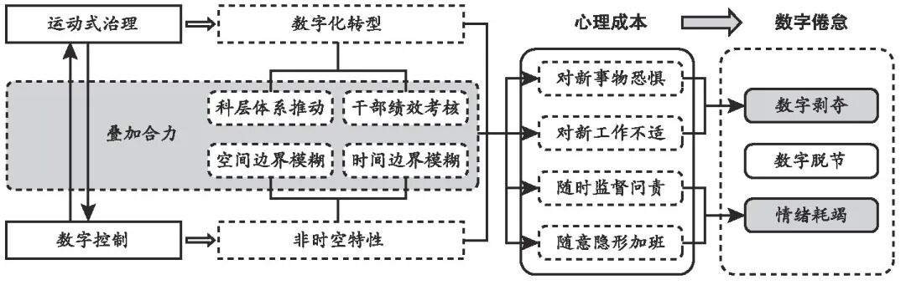 |

## 🌰5. 黄小勇, 刘倪. 数字行政负担的生成机理及消减策略——基于"组织-技术-用户"的分析框架 [J]. 电子政务, 2025, (04): 74-84.

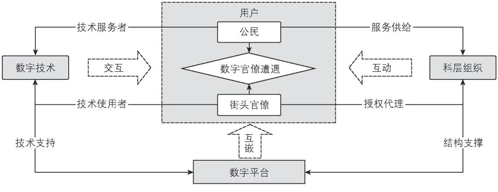

## 🌰6. 梁平汉, 刘洪志, 陈雨萱. 行政负担的生成逻辑——兼论为什么数字政府未能减轻行政负担 [J]. 公共管理评论, 2024, 6(04): 28-49.

基于合同理论：政府组织不完全合同（正式规章+非正式影子合约）与政府-民众隐性合约的冲突导致行政负担。

| 图1 | 图2 |
| --- | --- |
| 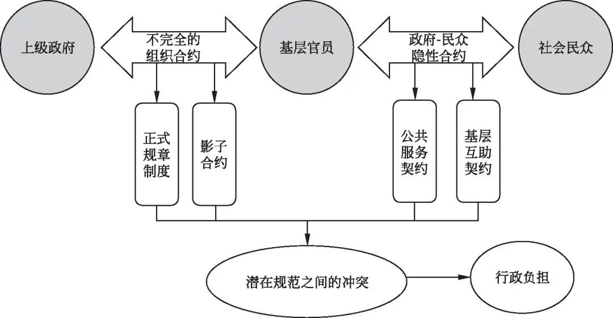 | 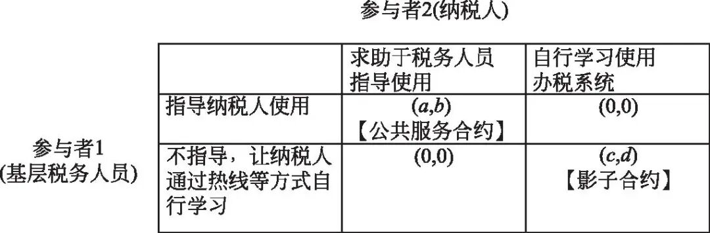 |
