# 【学术图例】跨域治理研究——10个机制与分析框架

> 来源：微信公众号「赫尔墨斯的公共管理百宝袋」（2024-11-16）
> 原文：https://mp.weixin.qq.com/s/WyV9bDII7G9yQHNKiGho5Q
> ⚠️ 图片版权归原作者与期刊所有，仅作学术索引；引用请引原始论文。

> 注：完整收录：10 组 21 张（经浏览器全文提取）。

## 🌰1.张晓杰,王丽丽.结构重塑与关系嵌入:跨层跨域环境治理中平行部门间协作的实现逻辑[J].公共管理学报[2024-11-16]

| 图1 | 图2 |
|---|---|
| 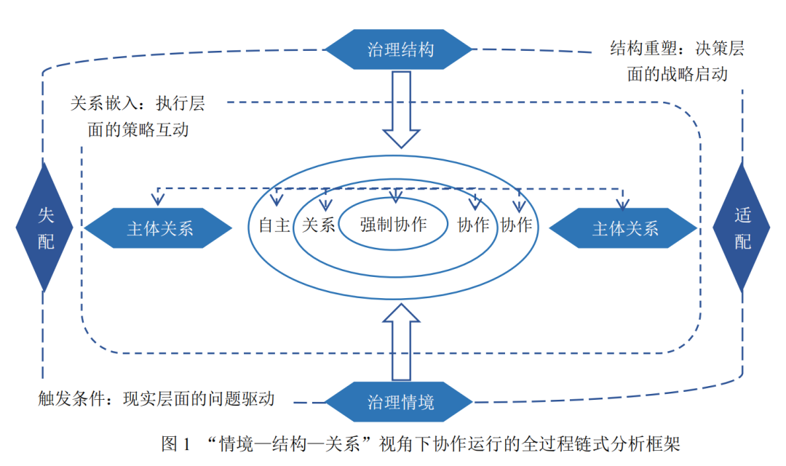 | 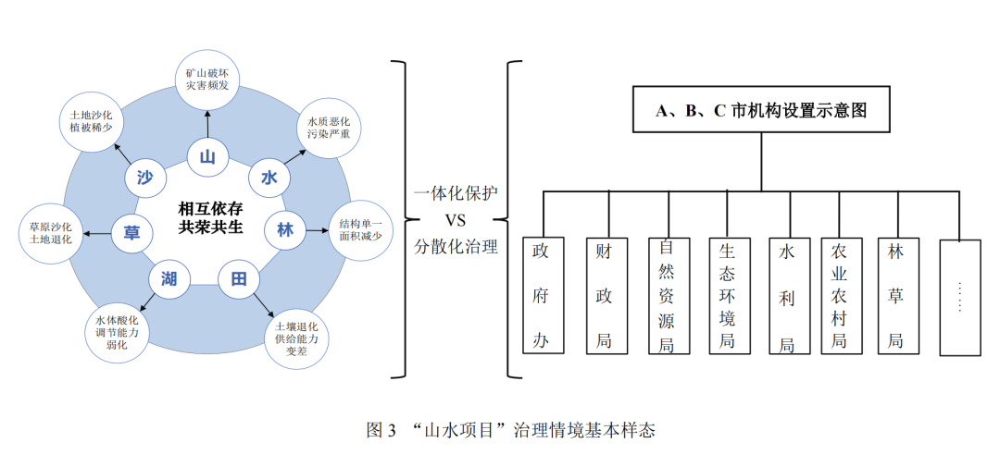 |

| 图3 |
|---|
| 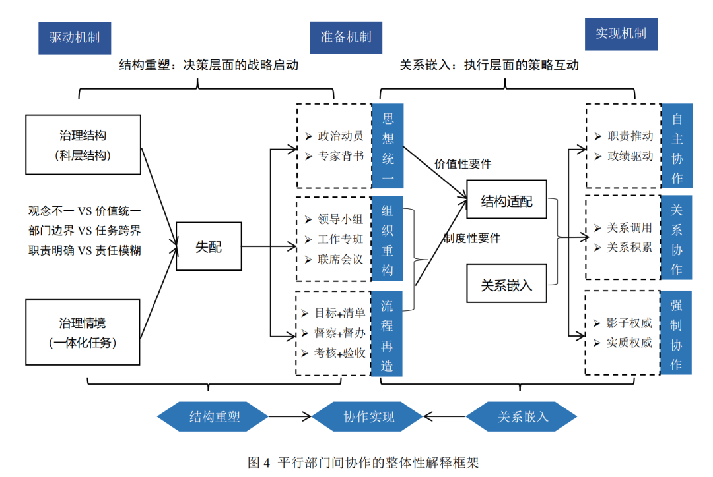 |

## 🌰2.崔晶. 地方政府跨域环境治理中的"竞优"与"协作"——以H钢铁公司搬迁为例[J]. 行政论坛,2021,28(5):58-64

| 图1 |
|---|
| 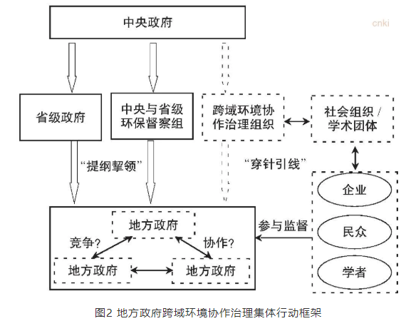 |

## 🌰3.锁利铭,冷雪忠.中国区域环境协同治理的“适应性嵌套”逻辑——基于社会生态系统框架的分析[J].理论与改革,2024,(05):109-128

| 图1 | 图2 |
|---|---|
| 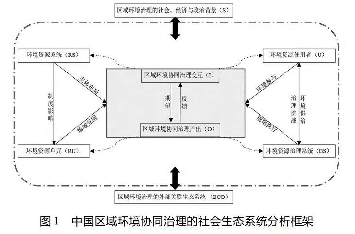 |  |

## 🌰4.杨小虎,魏淑艳.PPP模式下跨区域生态环境合作治理网络研究[J].东南学术, 2023(5):176-188

| 图1 |
|---|
| 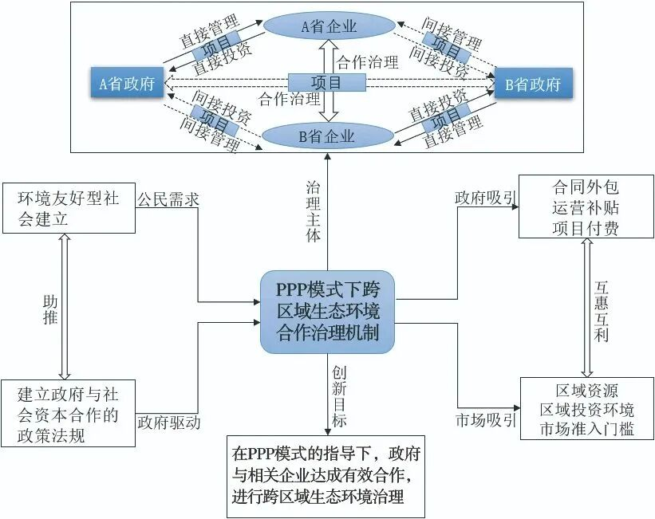 |

## 🌰5.杨旭，高光涵.跨域环境治理的组合式协同机制与运作逻辑——长三角生态绿色一体化示范区的个案研究[J].河海大学学报(哲学社会科学版)，2023，25(5):95-109

| 图1 | 图2 |
|---|---|
| 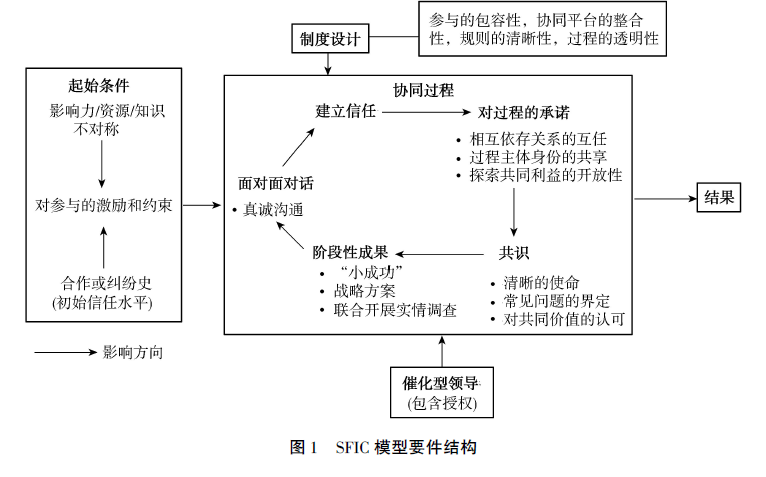 | 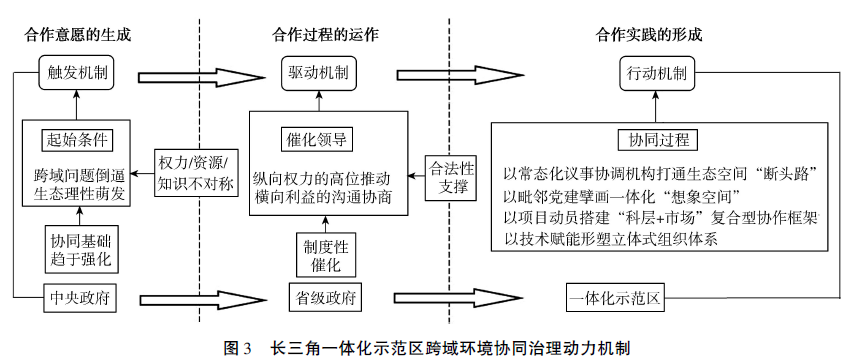 |

| 图3 | 图4 |
|---|---|
| 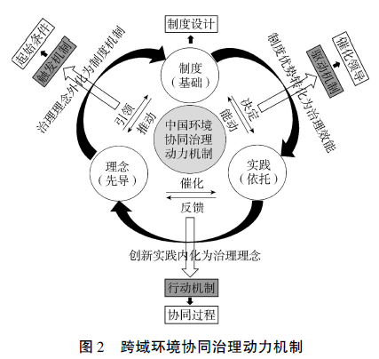 | 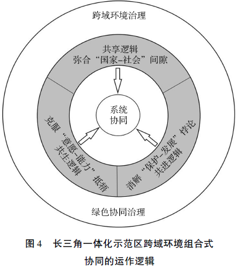 |

## 🌰6.戴胜利,云泽宇.跨域水环境污染"协力—网络"治理模型研究——基于太湖治理经验分析[J].中国人口·资源与环境, 2017, v.27;No.207(S2):150-155

| 图1 | 图2 |
|---|---|
| 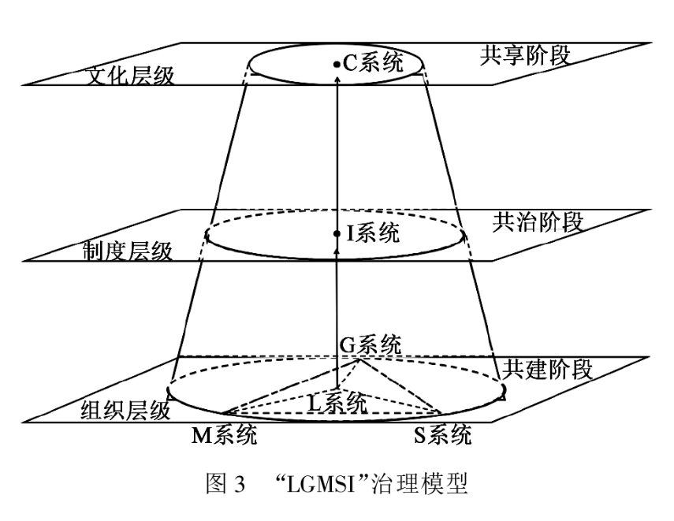 | 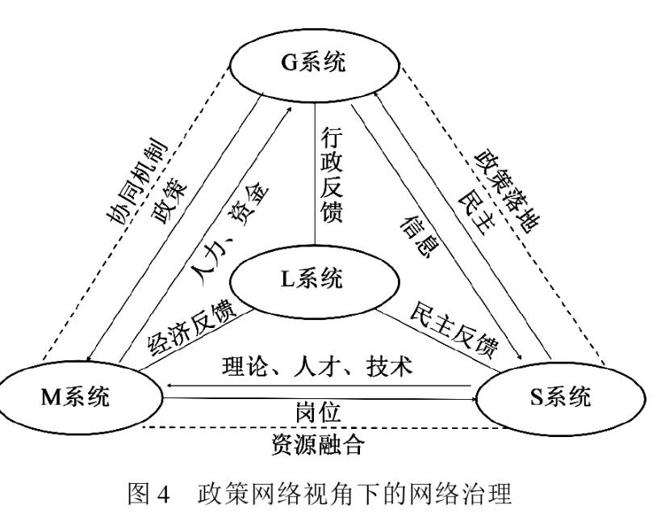 |

## 🌰7.李瑶,耿元文,林琴琴.京津冀公共体育服务跨域治理多主体协同关系与优化策略[J].山东体育学院学报,2024,40(3):29-39,48

| 图1 | 图2 |
|---|---|
| 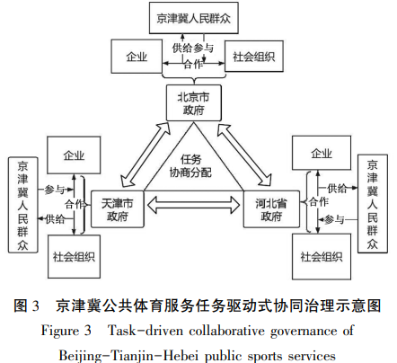 | 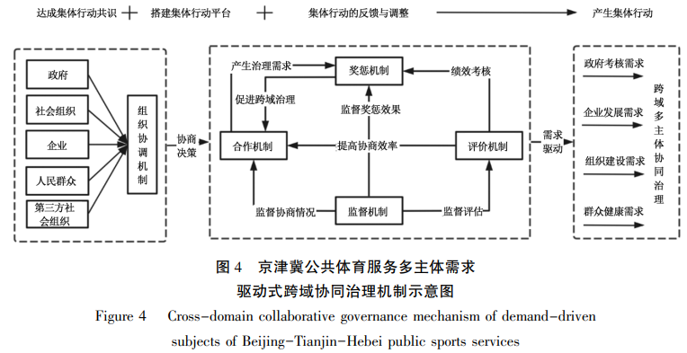 |

## 🌰8.刘泽照，马瑞.跨流域污染治理流变：空间、势能与注意力——基于南四湖考察的案例研究[J].公共治理研究，2023，（3）：41-50

| 图1 | 图2 |
|---|---|
| 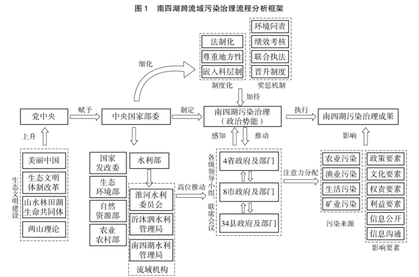 | 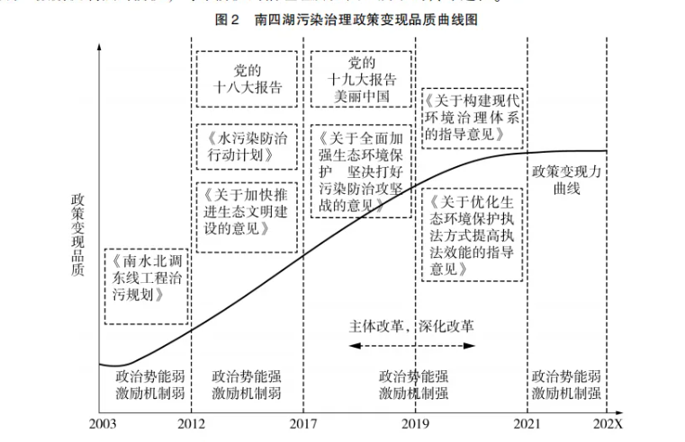 |

## 🌰9.张桂蓉,曹子璇.跨界环境治理中国家级新区与行政区互嵌式合作机制的生成逻辑——基于Z流域黑臭水体治理的案例研究[J].行政论坛, 2022, 29(5):118-126

| 图1 | 图2 |
|---|---|
| 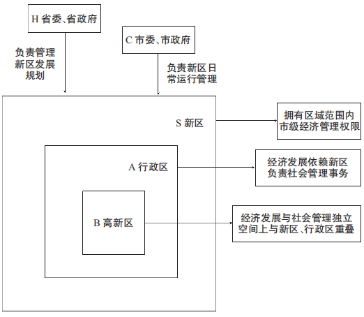 | 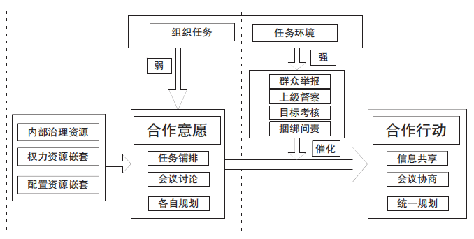 |

## 🌰10.王佃利, 滕蕾.结构重塑、政策政体与跨域治理:黄河国家战略推进中的协同提升策略[J].广西师范大学学报（哲学社会科学版）, 2023, 59(3): 25-33

| 图1 | 图2 |
|---|---|
| 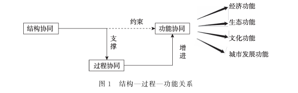 | 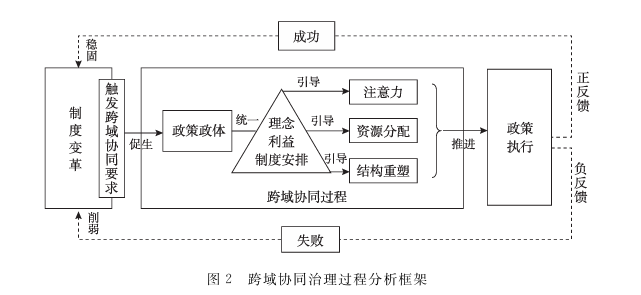 |
